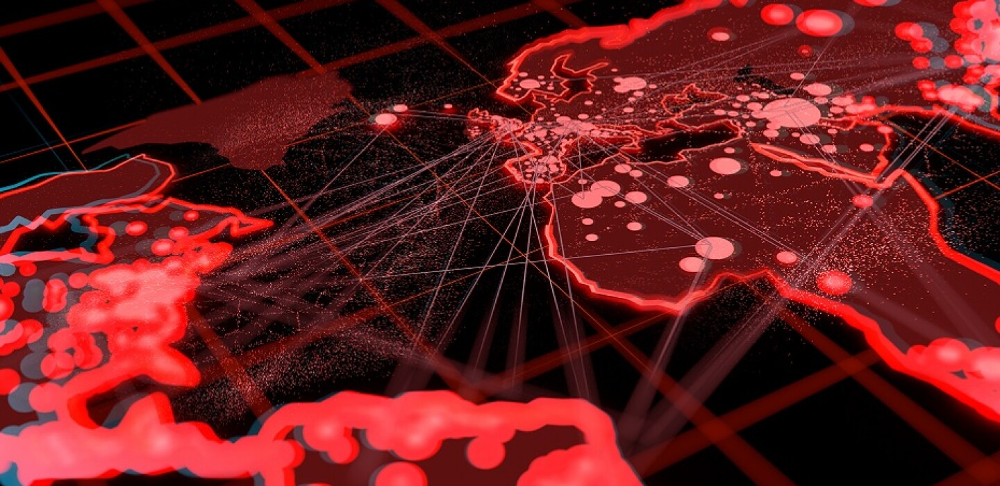

## **Africa is a target.**

  

Africa is immensely endowed with natural resources, ranging from agricultural bounty to water, minerals, and gold. However, it appears that certain major global powers are engaged in efforts to destabilize the continent, seemingly to facilitate even greater resource extraction.

Take Tanzania as an example: despite being among the richest countries globally in terms of natural resources, it has one of the lowest GDP per capita figures. This discrepancy raises the question: is Tanzania being exploited?

Fortunately, Tanzania benefits from a stable government, characterized by strong leadership, a clear vision, and a commitment to national improvement. Regrettably, not all African countries are in a similar position.

From our perspective, there are three primary mechanisms enabling this exploitation:

1. **Investment Deals Leading to Debt**: Such arrangements often empower external entities at the expense of the host country's autonomy.
2. **Mass-Scale Internet Information Manipulation**: This is particularly evident in situations involving country takeovers or coups d'état.
3. **Corruption and Greed**: This combination results in inequitable agreements that disadvantage the affected countries.

Currently, we are witnessing significant geo-political maneuvers. The world's major powers seem to be carving up Africa among themselves, each vying to secure resources for their future needs.

* [https://www.bbc.com/news/world-africa-46783600](https://www.bbc.com/news/world-africa-46783600)
* [https://www.usip.org/publications/2022/02/sixth-coup-africa-west-needs-its-game](https://www.usip.org/publications/2022/02/sixth-coup-africa-west-needs-its-game)
* [https://media.africaportal.org/documents/KAIPTC-Policy-Brief-3---Coups-detat-in-Africa.pdf](https://media.africaportal.org/documents/KAIPTC-Policy-Brief-3---Coups-detat-in-Africa.pdf)  

We are of the view that manipulation of information, encompassing aspects like cyber warfare and psychological information tactics, is not only a critical component but also the most straightforward method to facilitate such geopolitical maneuvers.