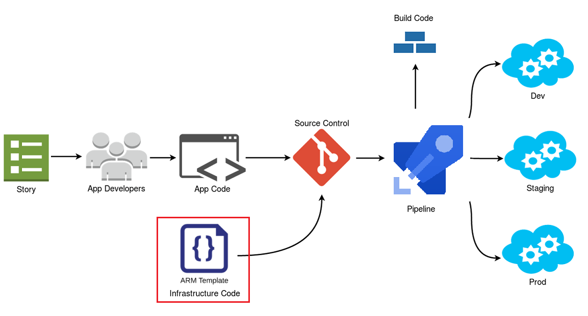

## Limit Amount Of Centralization

### Avoid centralization of people

Too often few people have too many superpowers, this is dangerous. These people can sometimes unwillingly be the access point for hackers to enter the system. Of course, there are also cases where people themselves get paid lots of money to open doors for others or extorted. 

Use systems where deployment of a solution happens in a 100% deterministic way and where consensus between people and teams needs to be achieved. 

### Infrastructure as Code Might Help

  

[Infrastructure as code](https://en.wikipedia.org/wiki/Infrastructure_as_code) is a good methodology to organize and your deployment, but also here in most systems few people have too much power, it's a good starting point and with some simple tricks such a system can be made more decentralized and consensus driven.

Do note, most current systems are not good enought, they havily rely on superpowers of some developers.

