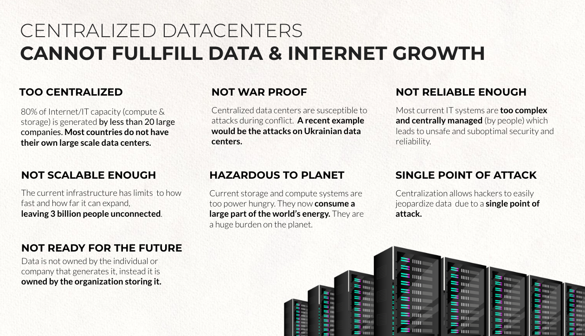

## **Centralization is a root cause of issues**

  

The more centralization the more it's rewarding to hack. Spending millions to hack a system with millions of users is rewarding. Hacking a decentralized system where everyone needs to be dealt with individually is commercially far less rewarding .

Centralized systems are extremely vulnerable, the hacking surface is often massive. Social engineering, backdoors, javascript & browser vulnerabilities, … lead to huge breaches when hacking happens.

### **The centralized services give out a lot of information**

Services like Google, Facebook, … do have access to our full personal life. Where are we, what do we buy, how do we travel, who do we meet, what do we search for, it's now proven that our personal and business information are being compromised and used during our illusion of security and privacy. Many claim that this information is being used outside of the scope of the privacy regulations or even the expectations of the users. The real value lies in the personal data, as much as in the products and services purchased.