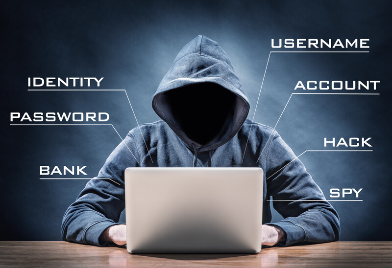
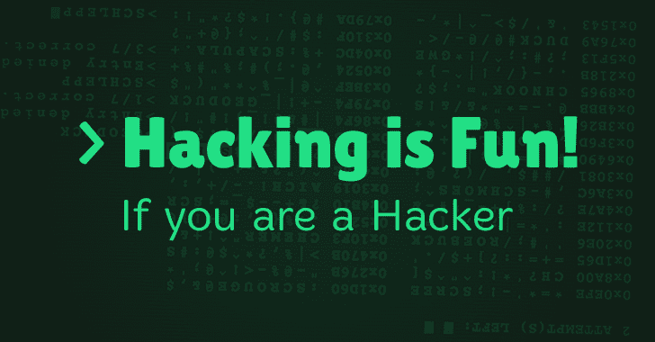

## **Hackers like to hack**

Many of them don’t feel appreciated by “normal” society and they wanna use their superpowers to work on alternative domains. Hacking gives them a purpose and they become powerful and important.

Hacking can be used to:

* Get access to private information. 
    * Spying on governments and their people.
    * Can be intellectual property, political information,  \
business tactics, defense/military information...
* Manipulate information 
    * Done much more than we think, done on a massive scale with millions of people at once.
    * E.g. every search you do in e.g. Google is manipulated for you as a target.
* Compromise important people, to get something in return.
* Hack other devices
    * In most cases, devices are hacked to become a tool to further hack or do denial of service.
* Tools for war
    * Today hacking can be used to do denial of service attacks on e.g. power plants, governments, … Some have happened already, we expect this will be much more the case.
* Ransom
    * Most victims do not speak about it, because they don’t want to tell the world, shame.
    * It's very good business and happens a lot.

  