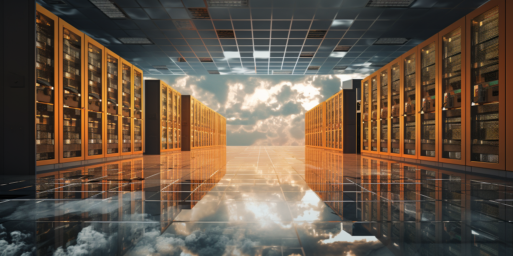

# Datacenter Cost

The cost to build a data center can vary widely based on numerous factors, including location, design specifications, infrastructure quality, and the intended power capacity per rack. 

### Factors Influencing Data Center Construction Costs:

1. **Power Capacity and Redundancy**: Higher power per rack generally means more robust electrical infrastructure, including transformers, generators, uninterruptible power supplies (UPS), and distribution units. Redundancy levels (N+1, 2N, etc.) also impact cost.

2. **Cooling Systems**: As power per rack increases, so does the need for efficient cooling. Advanced cooling systems (like in-row cooling, liquid cooling, or chilled beam systems) can significantly increase costs.

3. **Land and Construction**: The location and the local price of construction play a significant role. Urban areas typically have higher costs compared to rural areas.

4. **Building Specifications**: The cost is influenced by whether you are retrofitting an existing building or constructing a new one, including the need for raised floors, structural reinforcements, and security measures.

5. **Network Infrastructure**: High-quality cabling, switches, and routers are essential, especially for higher-density setups.

6. **Energy Efficiency Measures**: Investments in energy-efficient design and equipment (like energy-efficient UPS systems, solar panels, or advanced building management systems) can increase initial costs but often reduce operational costs in the long term.

### Rough Cost Estimates:

- **Low-Density Setup (1-5 kW per rack)**: For a traditional data center with lower power densities, construction costs might range from \$7 to \$12 million per MW of IT load.

- **Medium-Density Setup (5-10 kW per rack)**: This requires more robust infrastructure and might cost between \$10 to \$15 million per MW of IT load.

- **High-Density Setup (10-20+ kW per rack)**: For high-density environments, especially those needing advanced cooling solutions, the cost can exceed \$15 million per MW of IT load.

### Additional Considerations:

- **Economies of Scale**: Larger data centers often enjoy lower costs per MW due to economies of scale.
- **Operational Costs**: Operational expenses, including energy, maintenance, and staffing, can significantly impact the total cost of ownership.
- **Customization and Future-Proofing**: Costs increase if the data center is designed for specific needs or built with the capability to easily upgrade and expand in the future.

Given these variables, it's essential for an organization to thoroughly analyze its specific requirements and future growth expectations when planning a data center. Consulting with architects and engineers who specialize in data center construction can provide more precise cost estimates based on current market conditions and specific requirements.