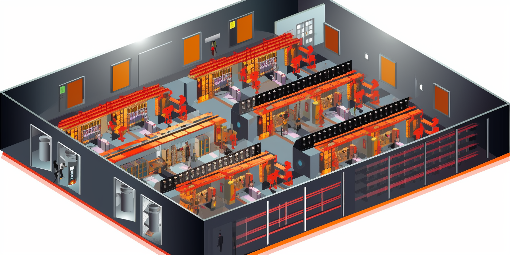

# Tier 3

A Tier 3 data center is a type of data center facility that is designed to provide a high level of availability and redundancy for IT infrastructure and data storage. Tier 3 data centers are classified based on the Uptime Institute's Tier Classification System, which defines four tiers (Tier 1, Tier 2, Tier 3, and Tier 4) to categorize data centers according to their design and infrastructure capabilities.

Key characteristics of a Tier 3 data center include:

1. **Availability**: A Tier 3 data center is designed to ensure 99.982% availability, which means it allows for an annual downtime of no more than 1.6 hours. This high level of availability is achieved through redundant components and systems.

2. **Redundancy**: Tier 3 data centers feature redundant power and cooling systems, as well as multiple distribution paths for data. Redundancy ensures that if one component or system fails, there is an alternative in place to maintain operations without disruption.

3. **Concurrent Maintainability**: A Tier 3 data center allows for maintenance and repairs to be performed on infrastructure components without affecting the normal operation of the data center. This is achieved through the use of redundant systems and pathways.

4. **Security**: Security measures are typically in place to protect the data center against unauthorized access, including physical security, access controls, and surveillance systems.

5. **Scalability**: Tier 3 data centers are designed to accommodate growth and expansion of IT infrastructure, making them suitable for businesses with evolving needs.

6. **High-Level Performance**: These data centers offer high-speed connectivity, low-latency network connections, and advanced monitoring and management capabilities.

It's important to note that while Tier 3 data centers provide a high level of availability and redundancy, they are not as robust as Tier 4 data centers, which are designed to provide even higher levels of fault tolerance and uptime. The choice of data center tier depends on the specific needs and risk tolerance of the organization using the facility.

## Power Requirements

1. **Standard Range**: Typically, the power availability per rack in a Tier 3 data center ranges from 4 kW to 10 kW. This range is sufficient for most traditional computing needs.

2. **High-Density Options**: For more demanding applications, such as high-performance computing or for racks densely packed with servers, Tier 3 data centers may offer high-density zones where power availability can range from 10 kW to 20 kW or more per rack.

3. **Cooling Limitations**: The upper limit on power availability is often determined by the data center’s cooling capacity. As power density increases, so does the heat output, which must be effectively managed by the data center’s cooling systems.

4. **Custom Solutions**: Some data centers can customize power availability based on client needs. This can include providing additional power circuits or designing a specific area of the data center with a higher power capacity.

5. **Redundancy**: Since Tier 3 data centers offer N+1 redundancy, there is always at least one backup for each power component. This does not directly affect the power available per rack, but it ensures consistent availability of the supplied power.

6. **Scalability**: Many Tier 3 data centers are designed to allow scaling of power and cooling resources as the needs of the customers grow.

When a business is considering colocation or hosting in a Tier 3 data center, it's important to assess its power requirements carefully. For operations with high power demands, it might be necessary to discuss with the data center provider the possibilities of allocating additional power resources or choosing a high-density zone within the data center. Data center providers typically measure power in kilowatts (kW) per rack and will have different pricing models based on the power and cooling requirements of the equipment hosted.