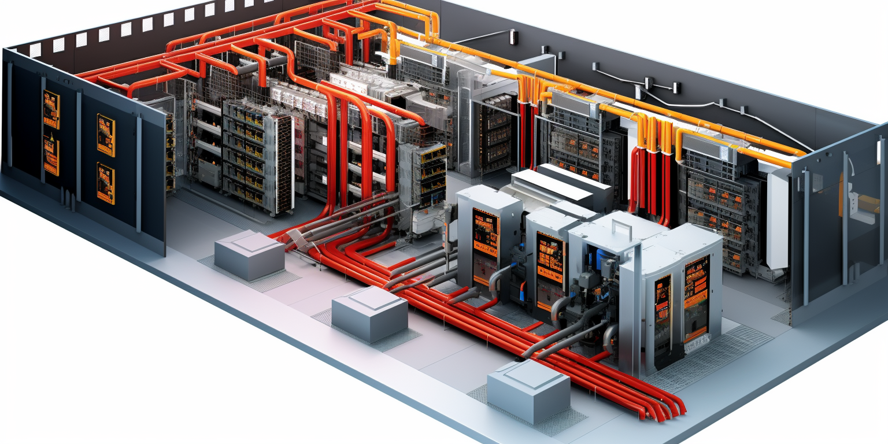

# Tier 4

A Tier 4 data center is the most advanced type of data center tier, as classified by the Uptime Institute. These tiers are a standardized methodology used to determine availability in a facility. The Tier 4 data center is the most robust and less prone to failures. Its design ensures redundancy and reliability. 

### Tier 4 Data Center:

1. **Uptime**: Designed for 99.995% availability.
2. **Redundancy**: 2N+1 fully redundant infrastructure (the highest level of redundancy in a data center).
3. **Components**: All components are fully fault-tolerant including uplinks, storage, chillers, HVAC systems, servers etc.
4. **Cooling**: Fully redundant cooling equipment.
5. **Concurrent Maintainability**: Everything can be maintained concurrently.
6. **Fault Tolerance**: Fully fault-tolerant with the ability to sustain at least one worst-case scenario fault without impacting critical load.
7. **Power Paths**: Multiple active power distribution paths.
8. **Downtime**: Approximately 0.4 hours of downtime annually.
9. **Target Audience**: Ideal for mission-critical operations such as large financial institutions, government data processing centers, and other high-demand networks.

### Key Differences:

- **Redundancy**: Tier 4 offers 2N+1 redundancy, meaning there is a double system for power and cooling (plus an additional backup), while Tier 3 typically offers N+1.
- **Fault Tolerance**: Tier 4 is fully fault-tolerant, meaning that any single failure of components does not impact services, unlike Tier 3.
- **Power Paths**: Tier 4 data centers have multiple active power paths, whereas Tier 3 has multiple paths but only one active at a time.
- **Downtime**: Tier 4 data centers have significantly less downtime per year compared to Tier 3.
- **Cost and Complexity**: Building and maintaining a Tier 4 data center is significantly more expensive and complex than a Tier 3 facility.

### Choosing Between Them:

- **Cost vs. Need**: Tier 4 data centers are significantly more expensive to build and operate. Organizations should assess whether they need the highest level of uptime and fault tolerance that Tier 4 provides.
- **Business Requirements**: Businesses that can afford occasional downtimes for maintenance or those that don't have extremely critical data operations may find Tier 3 facilities adequately sufficient.
- **Industry Compliance**: Certain industries may require or favor Tier 4 facilities due to regulatory requirements.

In summary, while both Tier 3 and Tier 4 data centers are designed to ensure high levels of uptime and reliability, Tier 4 takes this a step further with increased redundancy, fault tolerance, and a correspondingly higher price point.