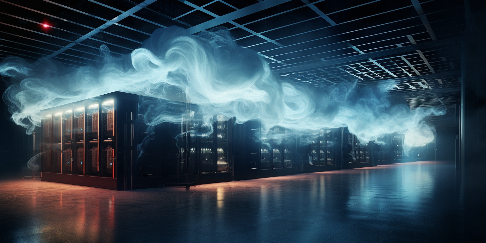

## Immersive liquid cooling

Immersive liquid cooling is an advanced technique used in data centers to manage the heat generated by electronic components, particularly in high-performance computing environments like those with dense GPU configurations. This cooling method involves directly immersing computer components or entire servers in a non-conductive liquid. There are two main types of immersive liquid cooling: single-phase and two-phase.

### Single-Phase Immersion Cooling

In single-phase immersion cooling, electronic components are submerged in a thermally conductive, but electrically insulating liquid. This liquid does not change its state; it remains a liquid as it absorbs heat. The process involves:

1. **Immersion**: Hardware (such as motherboards, GPUs, and CPUs) is placed directly into a bath of cooling liquid.
2. **Heat Absorption**: The liquid absorbs the heat generated by the electronic components.
3. **Heat Exchanger**: The now warmer liquid is pumped through a heat exchanger, where it releases the heat, and then recirculated back into the cooling bath.

### Two-Phase Immersion Cooling

Two-phase immersion cooling is more advanced. In this system, the liquid absorbs the heat from the components and then boils, changing its state from liquid to gas. The process involves:

1. **Boiling**: The heat from the electronic components causes the liquid to boil and change into a vapor.
2. **Condensation**: This vapor then rises to a condenser located at the top of the tank, where it cools and returns to a liquid state.
3. **Recirculation**: The liquid is returned to the main tank to absorb more heat from the components, repeating the cycle.

### Advantages of Immersive Liquid Cooling

1. **Efficiency**: Liquid is more effective than air at absorbing and transferring heat, allowing for more efficient cooling, especially in high-density configurations.
2. **Reduced Energy Consumption**: These systems can significantly reduce the energy consumption required for cooling, as the heat transfer is more direct and effective.
3. **Lower Noise Levels**: Immersive cooling systems are quieter than traditional air-cooled systems since there are fewer fans and moving parts.
4. **Increased Hardware Lifespan**: By maintaining consistent and optimal temperatures, these systems can prolong the life of hardware components.
5. **Space Saving**: This cooling method can reduce the overall space required for cooling infrastructure.
6. **Overclocking Potential**: Enhanced cooling efficiency can provide more headroom for overclocking CPUs and GPUs, potentially boosting performance.

### Challenges and Considerations

1. **Cost**: The initial setup cost for immersive liquid cooling systems can be higher than traditional air cooling systems.
2. **Maintenance**: Maintaining and servicing hardware immersed in liquid can be more complex and time-consuming.
3. **Compatibility**: Not all hardware is designed for or compatible with liquid immersion, and certain modifications may be necessary.
4. **Liquid Selection**: The choice of liquid is crucial, as it must efficiently conduct heat while not damaging the hardware or posing safety hazards.

Immersive liquid cooling is particularly suitable for data centers that require high-density computing power and are looking to optimize energy efficiency and cooling effectiveness. As computational demands continue to grow, especially with the proliferation of AI and machine learning, immersive cooling technologies are becoming increasingly relevant.