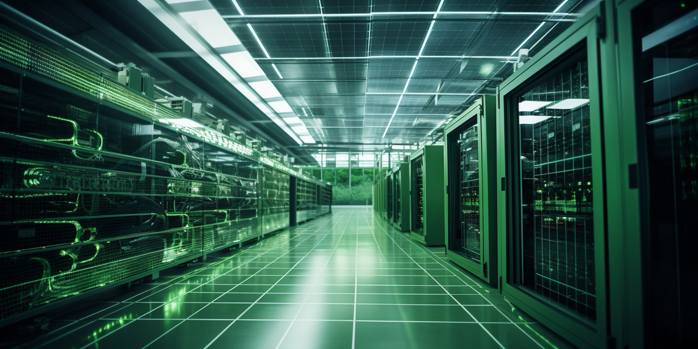
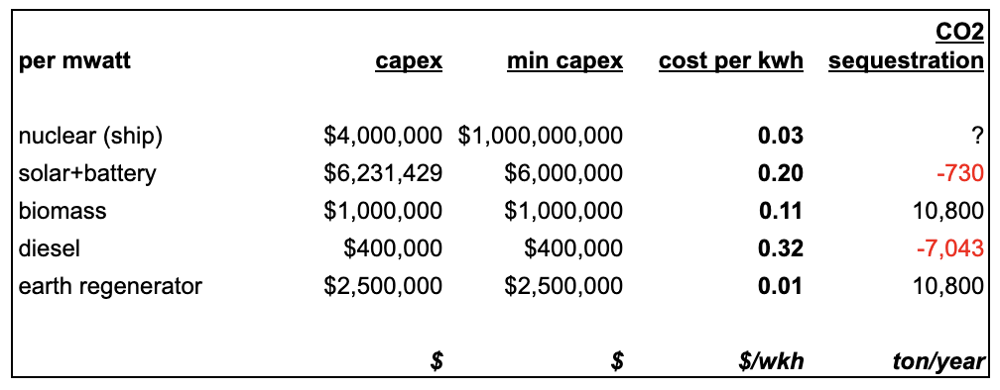

Power is the backbone of any datacenter, dictating space, cooling, and operating costs. The provisioning of enormous power capacity and redundant delivery systems makes power the primary infrastructure expense. 

Power requirements should guide datacenter design decisions starting at the facility location level. Proximity to utility power plants, substations, and high voltage transmission lines can reduce peak demand charges and upgrade costs. 

The design philosophy should emphasize maximizing power usage effectiveness through high-efficiency UPS systems, transformers, racks, and room layouts. Optimizing the load balance across power delivery paths also minimizes waste. 

Ongoing operating costs are dominated by power consumption for IT equipment, lighting, and cooling systems. 

Choosing energy efficient servers, virtualization, fresh-air cooling, and DC power can reduce energy costs over the decades-long lifespan of a modern datacenter. Expert planning of power infrastructure provides the foundation for an efficient, scalable, resilient, and cost-effective datacenter.

This section discusses how datacenters can be powered if electricity is not available to the extend needed.

## Overview

The earthregenerator has byproducts like organic fertilizer, bio fuel, ... and this make the electricity almost a byproduct which is very cost effective to generate.

## Conclusion

From best to worst.

### Nuclear

- probably still the best option at this stage especially when using generation 4 plants.
- cost price of electricity is great
- the upfront cost is sizeable and it takes years to build

### Earth Regenerator

- exciting new possibility, cost price is amazing
- planet impact is wonderful
- biggest downside is that this is new technology and requires early adopters
- do note that this approach requires a lot of land to produce the biomass

### BioMass

- proven technology, capex is low to get started 
- do note that this approach requires a lot of land to produce the biomass

### Solar

- not a bad option but still produces carbon
- capex is rather high
- cost price is not bad

### Diesel

- to be avoided, its just a very bad option

## More Info

- [Nuclear](power_nuclear.md)
- [BioMass](power_biomass.md)
- [Solar](power_solar.md)
- [Diesel](power_diesel.md)
- [H20 storage](power_h20.md)

