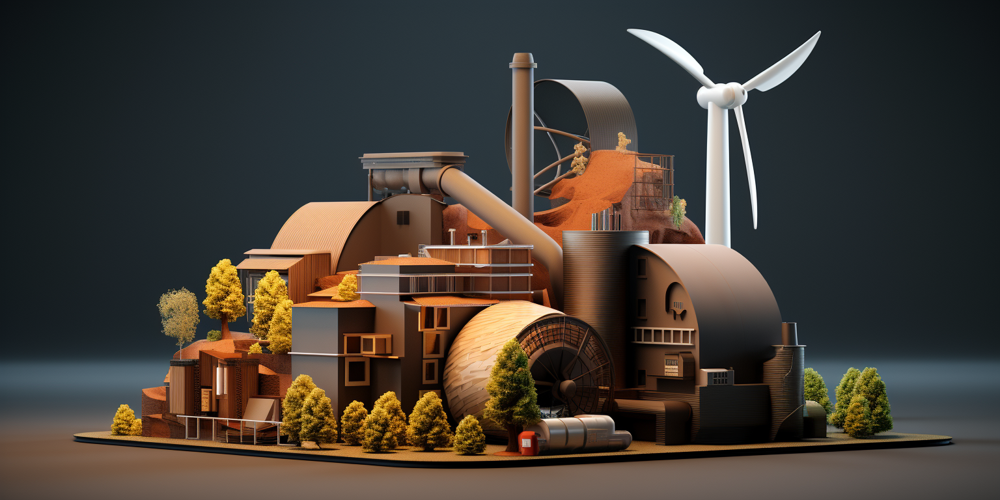
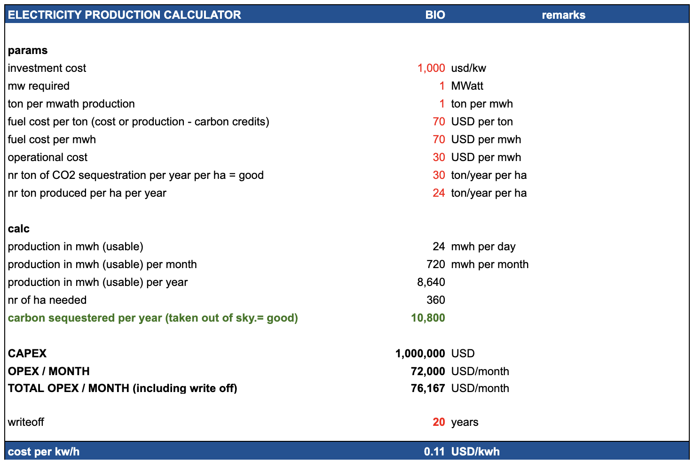

## Costs

## Impact on Planet

> great

- carbon sequestration (takes carbon out of sky)
- regenerates land
- energy cost of production is low

## Details

### Biomass needed

To generate 1 megawatt (MW) of electricity per hour from biomass requires approximately 1,000 kilograms (or 1 metric ton) of biomass fuel.

Here's a breakdown of the math:

* 1 MW of power = 1,000,000 watts
* With a typical biomass power plant electrical efficiency of around 25%, it takes 4 units of fuel energy to generate 1 unit of electrical energy.
* The energy content of biomass fuels varies by source, but a typical value is about 18 GJ per metric ton (at 10% moisture content).
* So to generate 1 MW of power for 1 hour requires:

1,000,000 W x 1 hr = 1,000,000 Wh = 3,600,000 kJ

At 25% efficiency, the fuel energy required is: 3,600,000 kJ / 0.25 = 14,400,000 kJ

With biomass containing 18 GJ/ton = 18,000 kJ/kg

The biomass fuel required is: 14,400,000 kJ / 18,000 kJ/kg = 800 kg, or approximately 1 metric ton.

So in summary, generating 1 MW of power from biomass for 1 hour requires burning approximately 1 ton of biomass fuel. The actual amount can vary slightly based on the biomass source and moisture content.

### Land size needed for production of 1 MW

- 1 generate 1MW we need 1 ton per h -> 8,640 ton per year
- 1 ha produces 24 ton per year -> 360 ha

### Cost to produce Hemp Biomass

> see the production cost calculation doc, $100 per ton is probably achievable, and if we deduct income from carbon credits it can be $70

### Cost per KWH

Here is the cost per kWh breakdown for a 1 MW biomass power plant:

Assumptions:

* 1 MW capacity
* 8,640 MWh annual generation
* $2,000,000 capital cost
* 10% interest rate on capital

Biomass Cost: $70/tonne (is biomass production - CO2 carbon credits)

* Annual biomass fuel cost: 8,640 tonnes x $70/tonne = $604,800
* Operational cost: $200,000
* Annual capital cost: $200,000
* Total annual cost = +-$1,000,000
* Cost per kWh = Total annual cost / Annual generation = $1,000,000 / 8,640 MWh = $0.11 per kWh

### Other Biomass Sources

Here is an overview of some of the most cost-effective options for farming biomass to be used for electricity production:

* Short rotation woody crops like willow or poplar:
    * Yield up to 8 dry tonnes/ha/year
    * Require low inputs like fertilizer
    * Cost around $50-60/dry tonne
* Perennial grasses like switchgrass or miscanthus:
    * Yield up to 20 dry tonnes/ha/year
    * Low input costs, well-suited to marginal land
    * Cost around $40-60/dry tonne
* Agricultural residues like straw and corn stover:
    * Already produced as byproducts of food crops
    * Cost just $20-40/dry tonne
    * Lower yields than dedicated energy crops
* Fast growing trees like eucalyptus:
    * Yield 10-40 dry tonnes/ha/year depending on climate
    * Cost around $40-50/dry tonne
* Hemp:
    * Yields around 8 dry tonnes/ha/year
    * Low input costs
    * Cost around $100-150/dry tonne

The lowest cost options are agricultural residues, but availability may be limited. Perennial grasses like switchgrass provide a good combination of high yields and low costs.

Overall, the optimal feedstock depends on local climate, land availability, and production costs. But several options can provide biomass at costs competitive with other fuel sources.
