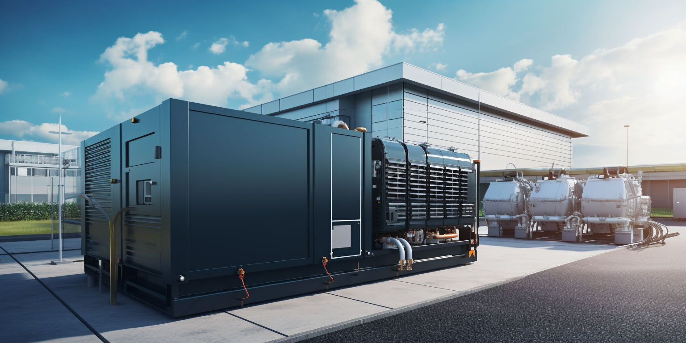
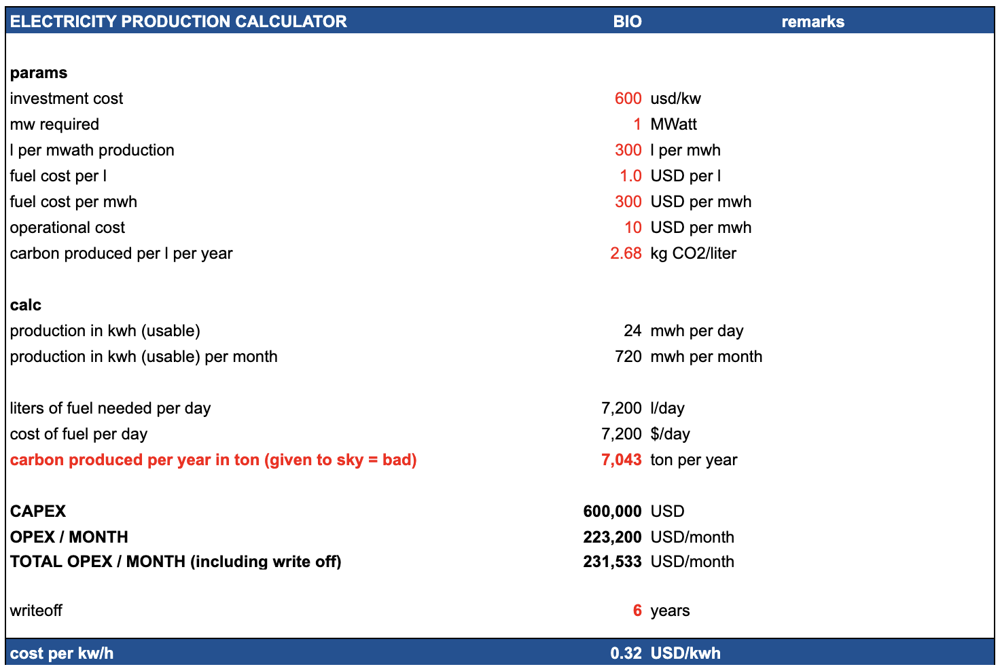

## Costs

## Impact on Planet

> awefull

- lots of carbon pollution
- takes out resources world doesn't have enough off

## Details

### Diesel Generator impact on Environment

Diesel electricity generation is considered bad for the environment for several reasons due to the negative impact it has on air quality, greenhouse gas emissions, and human health. Here are some key reasons why diesel-based electricity generation is harmful:

* 1. **Air Pollution**: Diesel engines emit a variety of pollutants, including particulate matter (PM), nitrogen oxides (NOx), sulfur dioxide (SO2), and volatile organic compounds (VOCs). These pollutants can lead to poor air quality, smog formation, and respiratory problems in humans.
* 2. **Particulate Matter**: Diesel engines emit fine particulate matter (PM2.5), which are tiny particles suspended in the air. These particles can penetrate deep into the lungs and even enter the bloodstream, causing a range of health issues, including respiratory diseases, cardiovascular problems, and premature death.
* 3. **Nitrogen Oxides (NOx)**: Diesel engines produce significant amounts of nitrogen oxides (NOx), which contribute to the formation of ground-level ozone and smog. NOx emissions can worsen respiratory conditions, irritate the respiratory system, and impair lung development in children.
* 4. **Greenhouse Gas Emissions**: Diesel engines are fossil fuel-based and emit carbon dioxide (CO2) and other greenhouse gasses when burned. CO2 is a major contributor to global climate change and is a primary driver of the Earth's warming, leading to temperature rise, sea level rise, and extreme weather events.
* 5. **Black Carbon**: Diesel engines emit black carbon, a type of particulate matter that contributes to air pollution and has a warming effect on the atmosphere. Black carbon settles on snow and ice, reducing their reflectivity (albedo) and accelerating melting.
* 6. **Environmental Damage**: The extraction, production, and transport of diesel fuel contribute to environmental damage, including habitat destruction, water pollution, and ecosystem disruption. Oil spills during extraction and transport can harm aquatic and terrestrial ecosystems.
* 7. **Noise Pollution**: Diesel generators are noisy and can contribute to noise pollution in both urban and rural areas. Noise pollution can have negative impacts on human health, including stress, sleep disturbances, and cardiovascular issues.
* 8. **Limited Renewable Energy Integration**: Relying on diesel generators hinders the transition to cleaner and more sustainable energy sources like renewable energy (solar, wind, hydro) because it maintains dependency on fossil fuels.

To mitigate these environmental impacts, it's important to shift towards cleaner and more sustainable energy sources, such as renewable energy and grid-connected electricity. This transition not only helps reduce harmful emissions but also contributes to global efforts to combat climate change and improve air quality.

### Diesel Generator Consumption

Here are some details on the typical fuel usage and consumption of a 1MW diesel generator

> 1MW = 1 mega watt

A diesel generator uses about 400 liters/hour for 1 MW of power output:

- Diesel generator power output: 1 MW
- Diesel consumption: 400 liters/hour
- Diesel cost: $1.5 per liter

To generate 1 MW for 1 hour requires:
- Power: 1 MW  
- Time: 1 hour
- Therefore, diesel consumed is: 400 liters (given)

With diesel costing $1.5 per liter:
- Diesel consumed: 400 liters 
- Diesel cost: $1.5 per liter
- Total fuel cost = 400 liters x $1.5 per liter = $600

So based on a diesel consumption of 400 liters/hour for a 1 MW generator, and a diesel cost of $1.5 per liter, the estimated fuel cost to generate 1 MW of electricity for 1 hour is $600.

> do note that you need 1MW for e.g. 0.6MW usable electricity (the rest is lost to cooling and other overhead).

### Daily utilization

Daily diesel consumption:
- Generator uses 400 liters/hr at 1 MW
- Running for 24 hours 
- So total usage is: 400 liters/hr x 24 hrs = 9,600 liters per day

Daily fuel cost:
- Diesel consumed: 9,600 liters 
- Diesel cost: $1.5 per liter
- Daily cost = 9,600 liters x $1.5 per liter = $14,400

### 10 MWatt Datacenter

We believe a datacenter needs to be at least 10 MWatt these days (AI).

If the datacenter would use Diesel this would result in a bill of 140,400 USD per day.

### Electricity Cost Based on Fuel 

Parameters

* Diesel fuel price: I used $1000 per metric ton, which is a representative global industrial price. Fuel prices vary by region.
* Density of diesel: 0.83 kg/L is the standard density. This converts volume in liters to mass in kg.
* Energy density: 36 MJ/L is the energy content per liter of diesel. This is an important factor.
* Generator efficiency: 40% is a typical efficiency of converting the diesel fuel energy to electrical energy. Good generators range from 38-42% conversion efficiency.
* Fuel consumption: 0.28 L/kWh is the estimated diesel consumption rate for the generator size. The generator datasheet provides this specification.
* Fuel energy input per kWh: By dividing the 0.28 L/kWh by the 0.83 kg/L density, we get the kg of diesel fuel input per kWh output. This shows the physical energy content.
* Fuel cost per kWh: Multiplying the kg/kWh by the fuel cost per kg ($1000 per ton divided by 1000 kg per ton) calculates the literal fuel cost to generate each kWh of electricity.
* O&M cost: Operation, maintenance and other costs add about 10% typically.

The result:

* Diesel fuel price: $1000 per metric ton
* Density of diesel: 0.83 kg/L
* Energy density: Approximately 36 MJ/L
* Generator efficiency: 40%
* Fuel consumption: 0.28 L/kWh generated
* Fuel energy input per kWh generated:
    * 0.28 L / 0.83 kg/L = 0.34 kg per kWh
* Fuel cost per kWh:
    * 0.34 kg x $1000 per ton / 1000 kg per ton = $0.34 per kWh

Total cost including operational cost ~$0.38 per kWh

### Crude Oil Generation Plant

Here is an estimate of the capital cost for a 10MW electricity generation plant running on crude oil:

* For small-scale oil power plants, capital costs typically range from $1500-$2000 per kW of capacity.
* For a 10MW plant, the capacity-based costs would be:
    * 10,000 kW x $1500 per kW = $15 million
    * 10,000 kW x $2000 per kW = $20 million
* The crude oil boiler/combustor system likely costs around $2 million for 10MW scale.
* Turbines, generators and power system equipment adds $5-10 million.
* Balance of plant, construction, site development, permitting, engineering etc can cost $5-10 million.
* So the total capital cost would likely range from:
    * $15 million + $10 million + $10 million = $35 million (on the lower end)
    * $20 million + $10 million + $10 million = $40 million (on the higher end)

So in summary, the total installed capital cost for a 10MW crude oil power plant potentially ranges from $35 million to $40 million, with the per kW cost of the power generation equipment being the largest component. There are also significant ongoing fuel and O&M costs.

### Crude Oil

Crude Oil is super bad for the environment

* Crude oil price: $90 per barrel
* 150 kg per barrel
* Energy density: 45 MJ/kg
* Power plant efficiency: 38%
* Oil required per kWh: 0.092 kg/kWh
* Fuel cost per kWh:
    * 0.092 kg/kWh x $90 per barrel / 150 kg per barrel = $0.068
* O&M cost per kWh: $0.02
* Total cost per kWh:
    * Fuel cost: $0.068
    * O&M cost: $0.02
    * Total: $0.088 per kWh

Conclusion: cost would be around $0.12 if we take into consideration price of plant.
