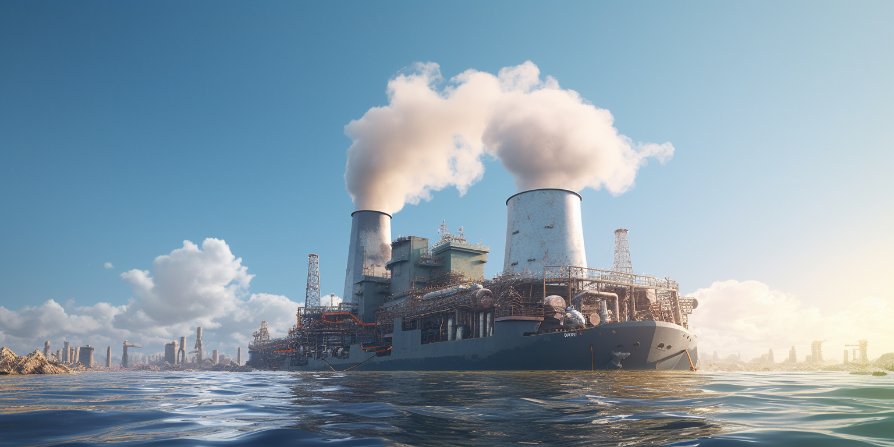
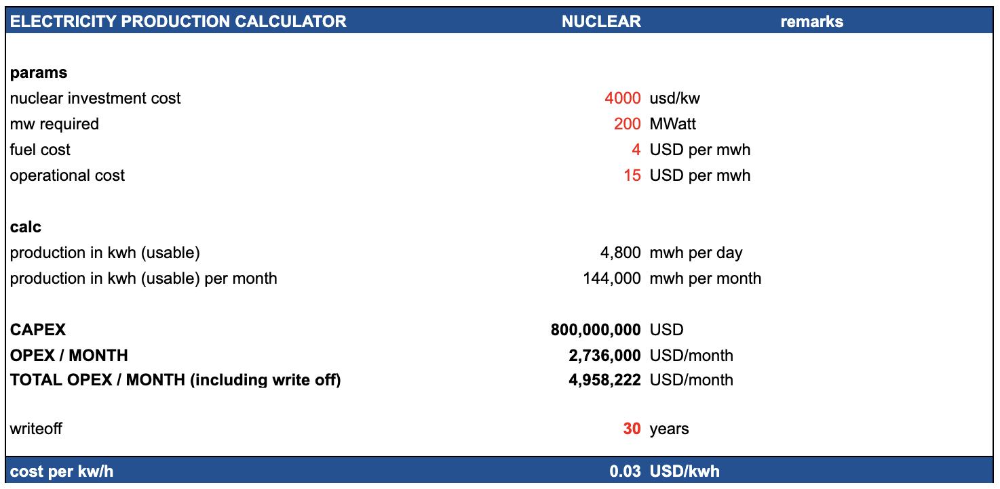

## Overview Cost

## Impact on Planet

> not so bad actually

- if managed well nuclear might be a clean source of energy, especially generation 4

## Details

The cost of building and operating a nuclear power plant varies significantly depending on numerous factors, including location, technology used, regulatory environment, and local labor and material costs. As of my last update in April 2023, here are some general estimates:

### 1. Capital Costs (Construction)

The capital cost of a nuclear power plant includes expenses for planning, licensing, site preparation, construction, and commissioning. These costs are highly variable but can be broadly estimated:

- **Western Nations:** In the United States and Europe, the capital costs for new nuclear plants can be very high, often ranging from $6,000 to over $9,000 per kilowatt (kW). This translates to $6 - $9 million per megawatt (MW).
- **Asia:** In countries like South Korea and China, costs are generally lower, often in the range of $2,000 to $4,000 per kW, or $2 - $4 million per MW.

### 2. Operational Costs

Operational costs include fuel, maintenance, and staffing. These costs can vary, but a general estimate is:

- **Fuel Costs:** Typically range from $5 to $10 per MWh.
- **Operation and Maintenance (O&M):** These costs are variable but can range from $20 to $40 per MWh in the U.S. and similar markets. In some Asian markets, these costs might be lower.

### 3. Total Cost of Electricity

The total cost of electricity from a nuclear plant includes capital, fuel, and operational costs, spread over the plant's lifetime and its electricity output. This can typically range from:

- **$40 to $120 per MWh (or 4 to 12 cents per kWh):** 

### Considerations

1. **Decommissioning Costs:** Eventually, a nuclear plant must be decommissioned, which can be a significant expense, but this cost is often accounted for over the plant's operational lifetime.

2. **Loan Interest:** The capital cost calculation often includes the interest during construction, significantly impacting the overall cost.

3. **Time Overruns:** Delays in construction can significantly increase the total cost.

4. **Waste Disposal:** The cost of nuclear waste management is another factor, though it's generally a small percentage of the total cost.

5. **New Technologies:** Advanced nuclear reactors, like Small Modular Reactors (SMRs), might offer lower costs and shorter construction times in the future.

These figures provide a general framework, but actual costs can vary significantly based on the specific project and region.