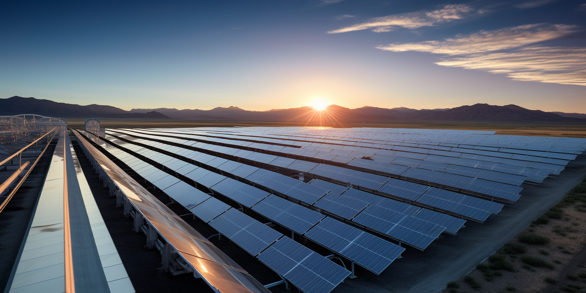
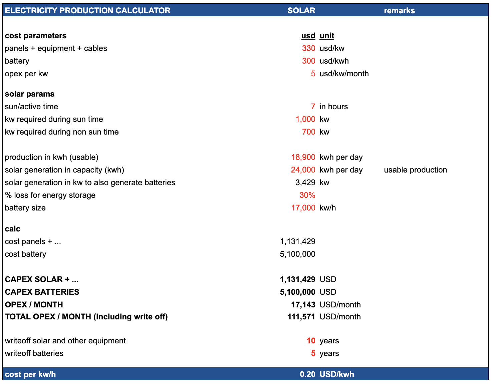

## Overview Cost

## Impact on Planet

> not bad but not ideal, still has carbon CO2 output (730 ton per year per mwatt)

- The production of 1 MW of solar panels is estimated to emit around 1,350 metric tons of CO2 (lots of energy production required). 
- The production of 1 MWh of lithium battery production is estimated to emit around 175 metric tons of CO2.
- takes out resources world doesn't have enough off (lithium) !!!

## Cost for solar power plant

Here is an overview of the typical capital costs for a 1MW solar photovoltaic power plant:

* Solar modules - $0.5 - $0.6 million for crystalline silicon panels rated at 5W per sqft.
* Inverters - $50,000 - $100,000 for grid-tied inverter system and controls.
* Mounting system - $50,000 - $150,000 for fixed tilt or tracking mounts.
* Electrical equipment - $50,000 - $100,000 for transformers, switchgear, monitoring.
* Site preparation - $50,000 - $100,000 for grading, access, perimeter.
* Installation labor - $50,000 - $100,000 depending on complexity.
* Permitting and engineering - $50,000 - $100,000.
* Total: Approximately $800,000 to $1.2 million.

The wide range accounts for differences in site location, labor rates, type of PV panels, mounting system and other factors. Economies of scale provide some cost savings for larger utility-scale systems.

1MW solar PV power plant expressed in terms of cost per square meter:

* Solar modules - $100 - $120 per sqm. Crystalline silicon panels are typically rated at 200W per sqm.
* Inverters - $10 - $20 per sqm. Sized based on peak capacity.
* Mounting system - $10 - $30 per sqm. Depends on mounting type.
* Electrical equipment - $10 - $20 per sqm.
* Site preparation - $10 - $20 per sqm. Grading and access roads.
* Installation labor - $10 - $20 per sqm. Based on crew size.
* Permitting/engineering - $10 - $20 per sqm.
* Total: Approximately $160 to $250 per sqm.

The total PV system size for 1MW is typically 4000 - 5000 sqm depending on the solar irradiance availability.

Cost of electricity (LCOE) from a 1MW solar PV plant based on the capital costs per sqm:

Assumptions:

* Capital cost: $200 per sqm
* O&M cost: $10 per kW-year
* Solar irradiance: 1,800 kWh/sqm/year
* System lifetime: 25 years
* Discount rate: 7%

Calculations:

* System size for 1MW with 1,800 kWh/sqm/yr: 1,000 kW / 1,800 kWh/sqm/yr = ~555 sqm
* Capital cost = 555 sqm x $200 per sqm = $111,000
* O&M cost = 1,000 kW x $10 per kW-year = $10,000 per year
* Annual generation = 555 sqm x 1,800 kWh/sqm/yr = ~1,000,000 kWh
* LCOE = (Capital cost x CRF + O&M cost) / Annual generation
    * Where CRF is capital recovery factor based on lifetime and discount rate
* LCOE = ($111,000 x 0.074 + $10,000) / 1,000,000 kWh = ~$0.085 per kWh

Ongoing O&M costs are relatively low for solar at around $10-$20k per MW capacity annually. No fuel costs obviously.

## Cost for batteries

Here is a realistic estimate of the current costs for battery energy storage including capital and operational expenses:

* Lithium-ion batteries capital cost today ranges from $100/kWh to $300/kWh for grid-scale systems larger than 1MWh.
* A realistic mid-range capital cost is around $185/kWh.
* Fixed O&M costs are typically $10-$15/kW-year.
* Variable O&M costs around 0.5-1 cent/kWh cycled.
* Annual throughput of 250-500 cycles depending on usage.
* Battery lifespan is 5-15 years before replacement needed.
* So for a 10MWh system the costs over 10 years would be:
    * Capital: 10,000 kWh x $185/kWh = $1.85 million
    * Fixed O&M: $12.5/kW-year x 1000 kW = $125,000/year x 10 years = $1.25 million
    * Variable O&M: Avg 400 cycles/year x 10 years x $0.0075/kWh = $300,000
    * Total 10-year cost = $3.4 million
* Levelized cost around $340/MWh over 10 years for this system.

Actual costs vary widely based on battery chemistry, scale, location, ancillary equipment and project specifics. But this provides a realistic estimate for modeling purposes. Let me know if you need any other details!

Here are some of the lowest cost battery storage technologies for grid-scale electricity:

* Lithium-ion batteries - $100 - $250 per kWh for utility scale. Costs continue to decrease rapidly.
* Flow batteries - $120 - $200 per kWh fully installed. Lowest cost is vanadium redox at $150/kWh.
* Lead acid batteries - Around $100 per kWh. Only viable for shorter duration needs.
* Compressed air energy storage - $50 - $100 per kWh based on site geology. Requires underground caverns.
* Pumped hydro storage - $100 - $300 per kWh. Highly site dependent. Cheapest at scale.
* Hydrogen storage - $250 - $400 per kWh. Requires hydrogen production and fuel cells. Emerging option.

So in summary, lithium-ion batteries offer the lowest cost currently at around $100-$250/kWh at utility scale. Their costs have fallen fast and are expected to continue improving. For long duration storage, pumped hydro and compressed air can be most economical depending on site suitability.

## Land needed

Here are some conservative estimates for the land area needed for a 5 MW solar PV facility in Africa:

* Assume a location in sub-Saharan Africa with an average solar insolation of 5.5 kWh/m2/day
* Use a conservative capacity factor of 15% for the solar PV system
* A solar panel with 20% efficiency and 1 m2 area will produce on average: 5.5 kWh/m2/day x 0.2 efficiency = 1.1 kWh per day 1.1 kWh/day x 365 days x 0.15 capacity factor = 61.2 kWh per year
* So each 1 m2 of solar panels will generate about 61.2 kWh per year
* The solar facility needs to generate 5 MW x 24 hours x 365 days = 43,800 MWh per year
* So total solar panels needed: 43,800,000 kWh / 61.2 kWh/m2 = 715,195 m2
* Add ~20% extra land for spacing, access roads etc.
* Total land area required: 715,195 m2 x 1.2 = 858,235 m2
* Which is 86 hectares or 0.86 km2

So for a 5 MW solar PV facility with a 15% capacity factor in sub-Saharan Africa, a conservative estimate is around 86 hectares or 0.86 km2 of land area.

If we only need it for 8 hours, then we can do ⅓

* We need 300,000m2 land for solar for the datacenter

## Ultra Capacitors

Here are some key points about using ultracapacitors for large-scale energy storage:

* Ultracapacitors can store and discharge electricity very quickly, making them well-suited for short duration load leveling and frequency regulation applications.
* They have high power density (up to 10 kW/kg) but relatively low energy density (around 5-10 Wh/kg), so large banks would be needed for bulk energy storage.
* Ultracapacitors have high cycle life (>1 million cycles) and high round-trip efficiency (95%+) which is attractive.
* Cost is still relatively high compared to Li-ion batteries at around $200-300/kWh for the ultracapacitor system. Rapidly improving though.
* Large ultracapacitor banks connected to the grid often use a hybrid system configuration with batteries or other storage to optimize performance and costs.
* Ultracapacitors provide excellent complement to batteries by handling high power transients and smoothing fluctuations.
* Safety advantages over batteries with no fire/explosion risks. More environmentally friendly.
* Could potentially reduce the required size of substation equipment like transformers and switches.
* Challenges include developing pilots to demonstrate benefits, reducing costs further, integrating into grid infrastructure and energy markets.

So in summary, ultracapacitors have promising characteristics for large scale energy storage but may be better suited to specific high power applications rather than bulk energy storage due to cost and energy density limitations currently. Their role alongside batteries warrants further exploration.
