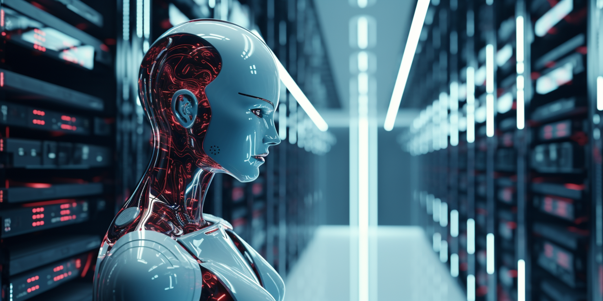

## AI Impact on Datacenter

The rise of Artificial Intelligence (AI) and machine learning (ML) has had a significant impact on data center design and operations. 

### 1. **High Power and Cooling Demands**:

- **GPU's can require more than 200 KW per rack, this means a 1 MWatt datacenter would only host 3 racks (rest is loss for cooling). Air cooling also becomes extremely difficult and expensive.**
 - **Power Requirements**: AI/ML hardware, especially dense GPU servers, consume significantly more power per rack than traditional servers, often necessitating enhanced power infrastructure.
 - **Cooling Solutions**: The high power usage translates to increased heat output, requiring more effective cooling solutions, possibly including liquid cooling or advanced air cooling technologies.
 
 ### 2. **Increased Computational Power**:

- **GPUs and TPUs**: AI/ML workloads often require GPUs (Graphics Processing Units) or TPUs (Tensor Processing Units) for efficient processing. This leads to the need for racks that can support high-density GPU/TPU servers.
- **Specialized Hardware**: AI/ML applications  require specialized hardware that can handle complex computations more efficiently than standard CPU's (huge GPUs).

### 3. **Enhanced Network Infrastructure**:

- **Bandwidth and Latency**: AI/ML workloads often involve large datasets, necessitating high-bandwidth and low-latency network infrastructure to efficiently move data in and out of the processing nodes.
- **Interconnectivity**: Enhanced interconnects are required for rapid communication between servers, especially for parallel processing tasks common in AI applications.

### 4. **Large Scale Storage Solutions**:

- **Data Storage Requirements**: AI/ML workloads typically require access to vast amounts of data. This necessitates large-scale storage solutions with high throughput and low latency.
- **Data Management**: Efficient data management systems are critical for AI/ML, as they often need to access and analyze large datasets.

### 5. **Reliability and Redundancy**:

 - AI and ML workloads are often mission-critical, requiring high levels of uptime. This may lead to more stringent redundancy and failover requirements in data centers hosting these workloads.

### 6. **Energy Efficiency**:

- Given the high power demand, implementing energy-efficient designs and technologies becomes crucial to control operational costs and reduce environmental impact.

### 7. **Scalability and Flexibility**:

- AI and ML needs can scale rapidly. Data centers must be designed to easily expand and adapt to changing requirements, including the adoption of newer, more powerful hardware over time.

### 8. **Security and Compliance**:
   
- AI/ML workloads often involve sensitive data, necessitating higher levels of security and compliance with data protection regulations.

### 9. **Edge Computing**:

- Some AI applications, especially those requiring real-time processing (like autonomous vehicles or IoT devices), benefit from edge computing. This pushes some data center capabilities closer to the data source to reduce latency.

## Some references

- https://www.upsite.com/blog/whats-driving-higher-rack-densities-in-the-data-center
- https://journal.uptimeinstitute.com/too-hot-to-handle-operators-to-struggle-with-new-chips/ (this isnt even for AI)