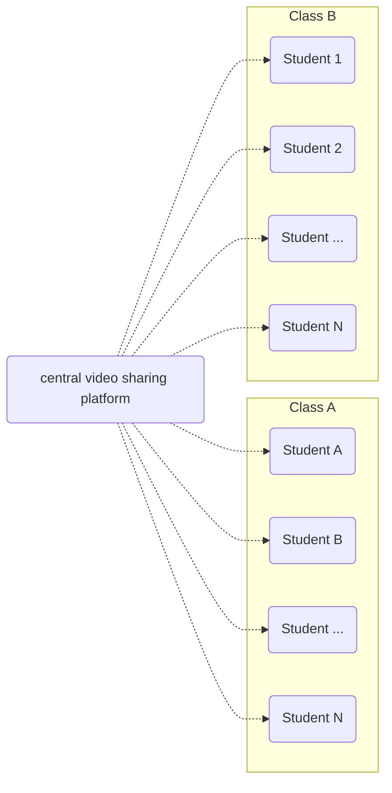
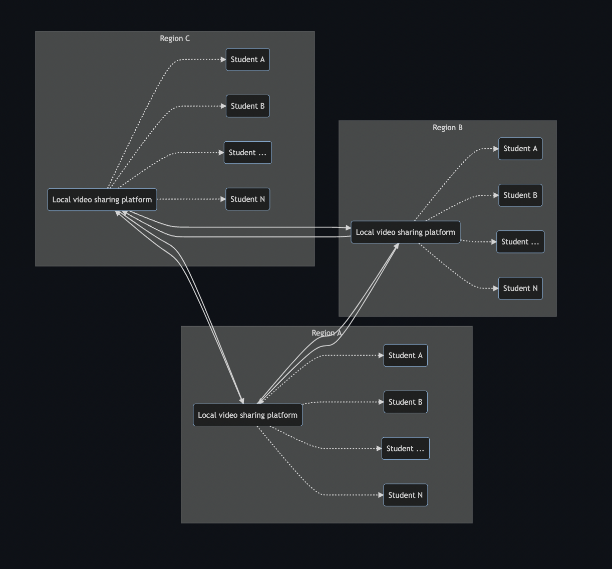
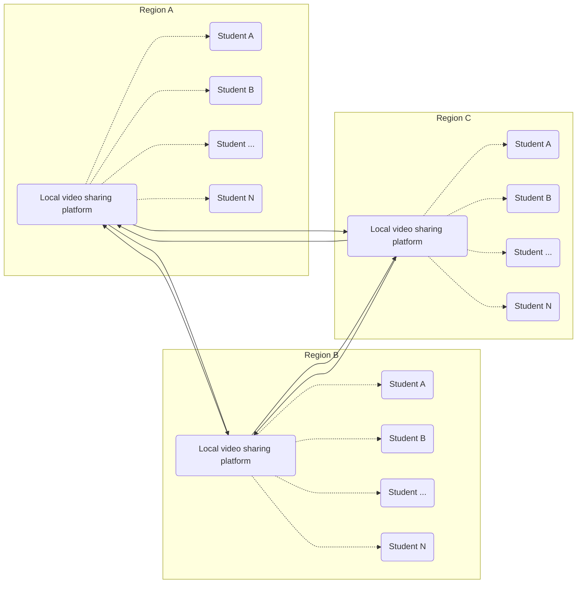

## Education

Education is a sector that still relies on traditional teaching methods, a teacher, a classroom, a black (or white) board, books, paper and pencils.  This method has been in use for hundreds of years.  In this digital age there the classroom can be a digital classroom, with a teacher teaching and all of the rest of the required items can be digitised as well.

Traditional learning is based on a live teacher, teaching an audience in a classroom. This works, however is has a number of restrictions which makes that work for a limited number of pupils, and not everywhere because of the necessity to have live teachers and pupils.  In this digital world we can record end present the learning materials in a digital manner to a much larger audience that a single classroom.  Classes, or better while curriculum can be digitised and share along a much larger group of pupils spanning a vast geographic area.

The Covid-19 pandemic has proven that remote teaching is possible and that the current technology allow for this.  This experience was still based on the standard teacher - pupil relationship and numbers for live teaching.  Another technology, a video sharing platform has proven that storing videos and sharing videos is a effective manner to reach a very large number of viewers (youtube.com).

Taking the learnings from both of these current use cases we have created Sikana. Improve your life - one skill at a time. Sikana is a free education platform, with more than 4 billion views, aiming to deliver quality education and necessary skills to everyone. The software can be installed on threefold nodes and deployed regionally so that bandwidth requirements are minimised because it is a decentralized online education platform.

To scale such a solution for many classrooms in many schools and in many different regions put enormous requirements and stress on the central video sharing platform.

Decentralized video sharing as an education platform as a platform will lower the requirements on the education / video sharing platform and creates, stores and distributes educational content from within a region, or even from within a school.  This allows this education solution to educate everywhere, even if there is no internet connection. A simple wifi router that connects devices to the educational platform is all that is needed.

   

4BILLION  COURSES DELIVERED

Our local infrastructure ensures data locality.

Over 3,000 Videos

We fuel content production through our network.

