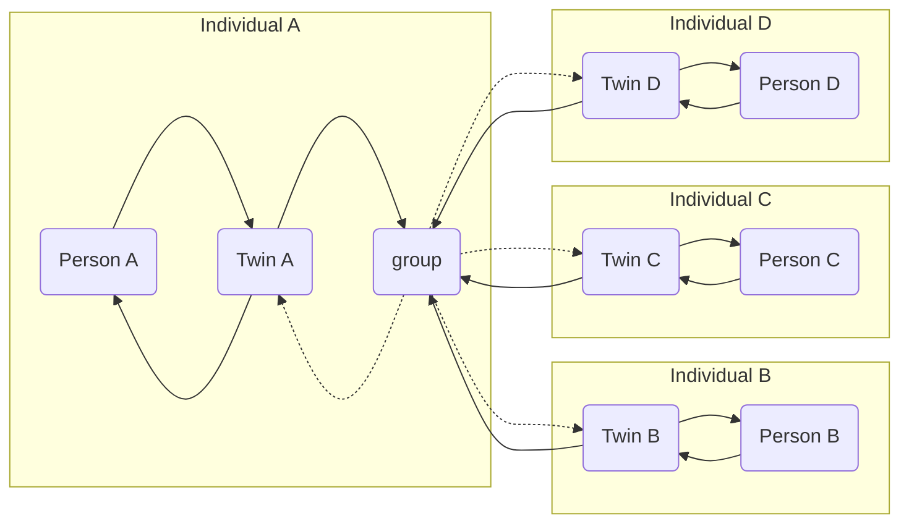

```mermaid
graph LR
    subgraph Individual A
    PERSONA(Person A) --> TWINA
    TWINA --> PERSONA
    TWINA(Twin A) --> GROUP(group)
    GROUP .-> TWINA
    end
    GROUP .-> TWINB
    subgraph Individual B
    TWINB(Twin B) --> GROUP
    TWINB --> PERSONB
    end
    PERSONB(Person B) --> TWINB
    subgraph Individual C
   GROUP .-> TWINC
    TWINC(Twin C) --> GROUP
    TWINC --> PERSONC
    end
    PERSONC(Person C) --> TWINC
       GROUP .-> TWIND
    subgraph Individual D
    TWIND(Twin D) --> GROUP
    TWIND --> PERSOND
    end
    PERSOND(Person D) --> TWIND
```