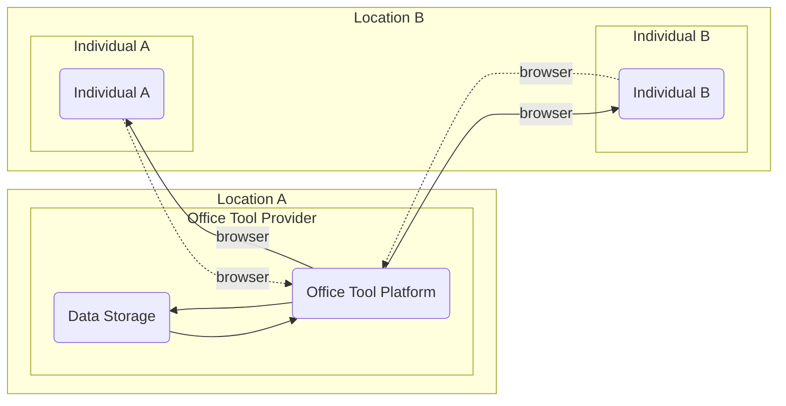
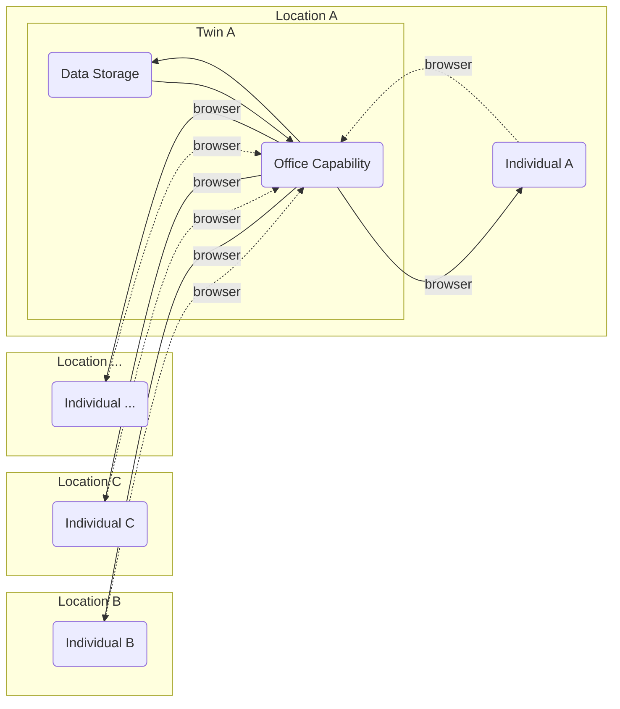
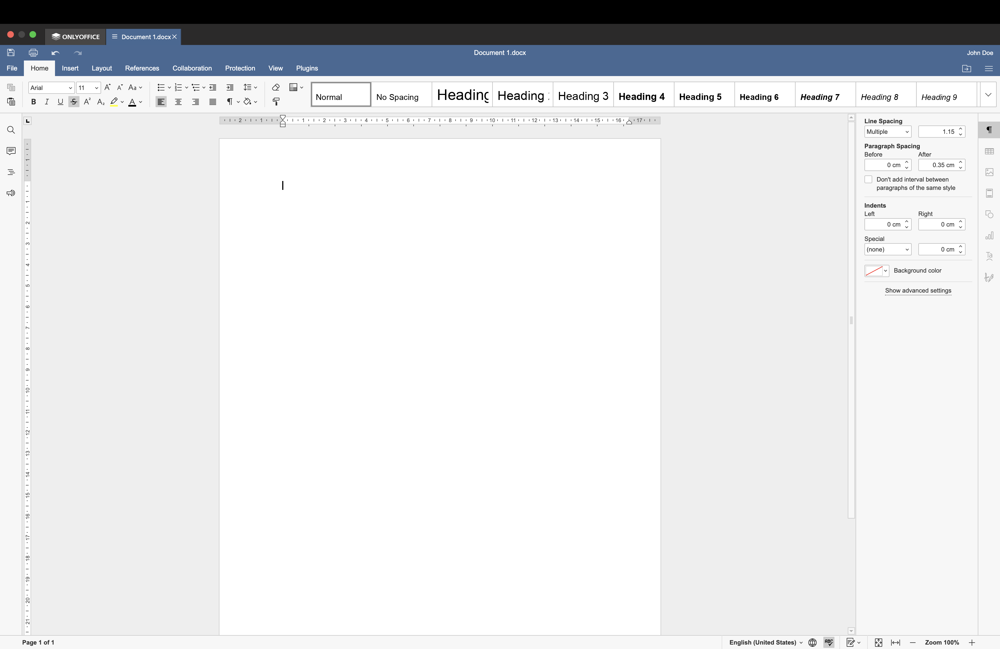
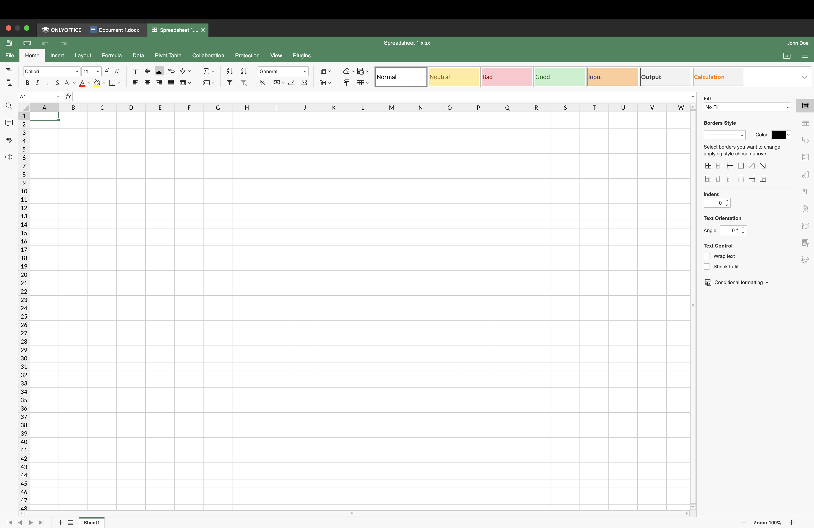
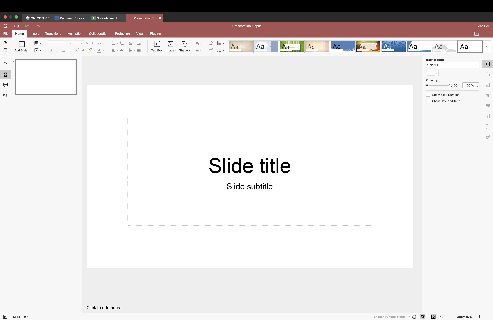

## Office Tools

The internet offers a number of office suites that you can use as a service.  Microsoft 365, Google Doc are the marketleaders and then there are a number of alternatives in local markets or in the oupen source community.

All office tools are provided in a centralised manner which means that all application and data processing activities happen in a large central datacenters and also data storage is done in that same datacente.

Although functionally this setup provides good co-working capabilities we see that both co-workers are using a central facility and the data is stored in that serivce provides datacenter.  This is how most online services work and most online service provider exist in the US, Europe and Asia.  This present challenges with regards to data ownership, sovereignty and all sort of other legal challenges.

Office tools can be deployed locally if and when there is a digital infrastucture that can process and store data.  The Twin technology allows the office tools to be run in country, owned by the individual or company and therefore all the names challenges and legal complexity fade.

The principle of doing it that way would look as follows:

This way, person A is providing the Office tool from his twin and invites other people to cooperate in this office tool. The Twin can run anywhere (as determined by the operator, person A).  With this priciple we can create individuals or companies that operate and own their own office tool and datastorage platform.

Screenshots of the office application capabilities:

### Settings

### Document

### Spreadsheet

### Presentation

