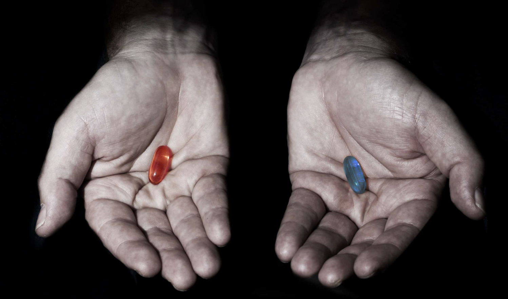

# We already live in the matrix.

# The world became insane, and most don’t question.

## Our money systems are broken

<table>
  <tr>
   <td>

   </td>
   <td><strong>Our major currencies are no longer Money</strong>
<ul>

<li>Over 40% of the Money US has EVER printed in its history was printed during last years (<a href="https://techstartups.com/2021/05/22/40-us-dollars-existence-printed-last-12-months-america-repeating-mistake-1921-weimar-germany/">source</a>).  \
 \
This basically means 40% of USD value has been stolen from the average USD holder.
<ul>

<li>Will current digital currencies save us?  \
No = many of them are backed by nothing but greed, \
They are disguised Ponzi schemes (new investors paying for old ones = pyramid of money).
</li>
</ul>
</li>
</ul>
   </td>
  </tr>
</table>

Interest is dangerous, it has the ability to paralyze economies, once countries have to raise debt to pay interest, it becomes super dangerous and quickly can lead to huge mountains of debt which takes away the ability for a country to use tax money to create wealth for its citizens.

## Moral degradation of values

We have lost our ability to  \

* make our own decisions
* understand compassion
* speak the truth
* give without expecting back
* touch things without destroying them
* recognize ourselves as individual beings
* be kind without ulterior reasons
* talk in our homes or tribes as one family
* predict the weather by the sound of trees and birds
* smile and act like children; along in our lives
* grow a crop naturally, communicate with animals
* live with the nature around us as one
* believe that you can also become a great individual (without being a “star”)
* respect others, even if mistakes are made \

**Fear, lying & ego became the new normal.**

Example

* Lying became an acceptable practice
    * e.g. Silicon Valley: business rule 1,”fake it till you make it”
* Claim something which is not yours.
    * e.g. there are millions of patents which have been granted on ideas which were not created by the new patent owners. It became a business of aggression & control.

Some of the root cause

* Money is the most addictive substance in our universe.
* Fear used as mechanism to control
* Misinformation (no more mechanism to recognise authenticity)
* Accepted use of human vulnerability to addiction (gaming, social media, marketing campaigns…)
* Education not in line with needs of future generation
* Unbalance between IQ,EQ and SQ. Personally we believe they are all equally important.
* People lost hope, often basic needs not covered, a new “phone” will not solve this.

Link to money

* Why is money a taboo? We don’t get educated nor know much about it.
* Making money became a purpose most live for. We believe this is wrong.
* Money can be beautiful, it's an energy exchange.
* Money represents “human time energy”, it's a tool for change.
* But the nature of money needs to change asap. Tools like Interest, derivatives and speculation are super dangerous. Most projects in blockchain space are just an enlargement of what already happened with our existing money system. 

## 

## Climate Change - is real, and happening too fast

**Some facts**

* Within the next 2 decades, global temperatures are likely to rise 1.5 degrees Celsius.
* More than 1 million species are at risk of extinction by climate change.
* The concentration of CO2 ​​​​​​​ in our atmosphere, as of July 2021, is the highest it has been.
* 7 warmest years in the 1880-2020 record have all occurred since 2014
* 11% of all global greenhouse gas emissions caused by humans are due to deforestation.
* 800 million people are currently vulnerable to climate change impacts, such as droughts, floods, heat waves, extreme weather events and sea-level rise. 
* Coastal ‘blue carbon’ ecosystems are critical, 800,000 hectares of mangroves lost every year
* ​​Climate change is already happening, and it’s detrimental to human life.
* Many leaders still aren’t taking it seriously enough.

**Hope 												_[source](https://www.conservation.org/stories/11-climate-change-facts-you-need-to-know) and [source](https://www.earthday.org/5-terrifying-climate-change-facts-scare-halloween/)_**

* ONLY US$ 140​ billion per year needed
    * This is what it would take to make the changes humanity needs to adapt to a warming world. It may sound like a lot, but it’s less than 0.2% of global GDP.
* Nature is an untapped solution
    * Tropical forests are incredibly effective at storing carbon, providing at least a third of the mitigation action needed 7 to prevent the worst climate change scenarios. Yet nature-based solutions receive only 3% of all climate funding. 
* Carbon credits could be a good system BUT
    * We need carbon removal = carbon net zero, suck carbon out of air.
    * Today +90% of carbon credits are based on lowering emission, this is not good enough.
    * There are simply not enough carbon removal projects and almost no attention is going to it. Building machines to suck carbon out of air is probably not the solution.
* Fight climate change, improve livelihoods — naturally
    * Natural climate solutions such as restoring degraded forests could create as many as 39 jobs per million dollars spent — that's a job-creation rate more than six times higher than the oil and gas industry.
* Coastal ‘blue carbon’ ecosystems are critical
    * Just 0.7% of the world’s forests are coastal mangroves, ​​​​​they store up to 10 times as much carbon per hectare as tropical forests. 

**_Everyone may die at the end of horror movies, but we don’t have to_**

