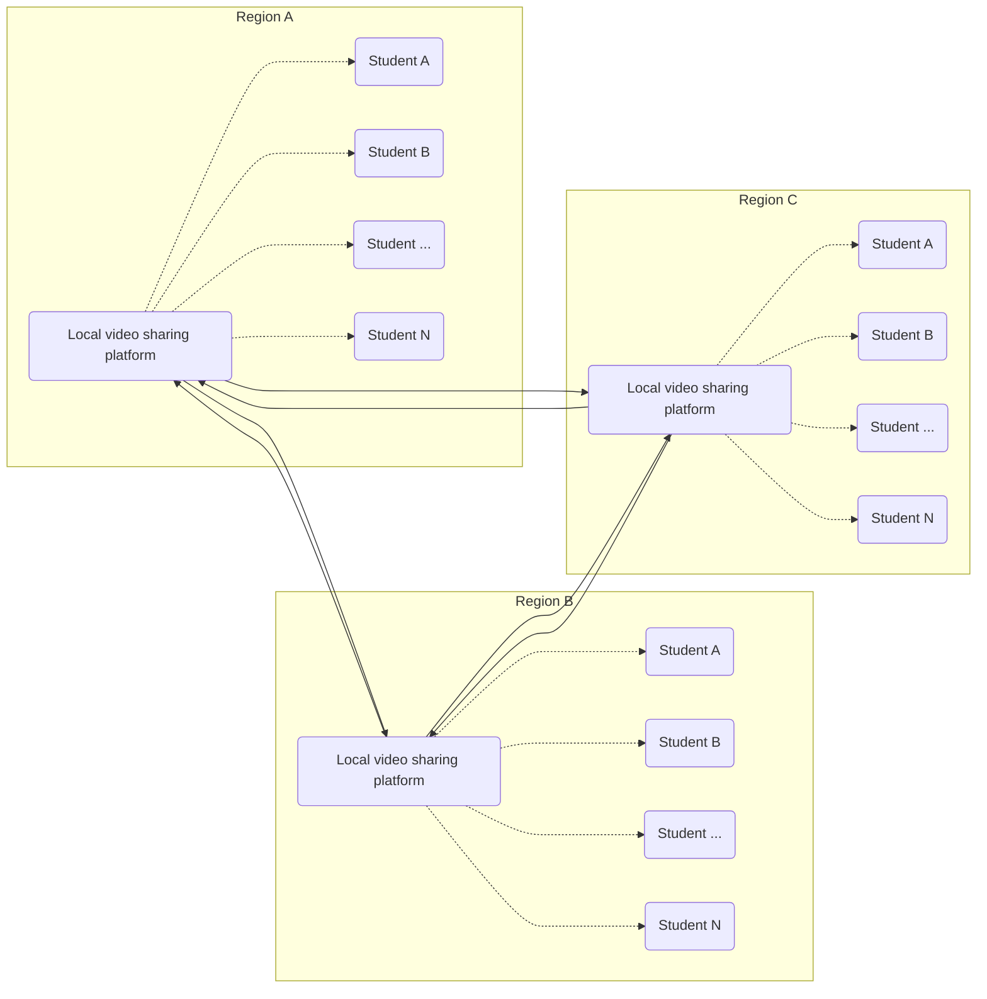

```mermaid
graph LR
    subgraph Region A
    INDIVIDUALAA(Student A)
    INDIVIDUALAB(Student B)
    INDIVIDUALAC(Student ...)
    INDIVIDUALAD(Student N)
    VIDEOPLATFORMA(Local video sharing platform)
    VIDEOPLATFORMA .-> INDIVIDUALAA
    VIDEOPLATFORMA .-> INDIVIDUALAB
    VIDEOPLATFORMA .-> INDIVIDUALAC
    VIDEOPLATFORMA .-> INDIVIDUALAD
    end

    subgraph Region B
    INDIVIDUALBA(Student A)
    INDIVIDUALBB(Student B)
    INDIVIDUALBC(Student ...)
    INDIVIDUALBD(Student N)
    VIDEOPLATFORMB(Local video sharing platform)
    VIDEOPLATFORMB .-> INDIVIDUALBA
    VIDEOPLATFORMB .-> INDIVIDUALBB
    VIDEOPLATFORMB .-> INDIVIDUALBC
    VIDEOPLATFORMB .-> INDIVIDUALBD
    end   

    subgraph Region C
    INDIVIDUALCA(Student A)
    INDIVIDUALCB(Student B)
    INDIVIDUALCC(Student ...)
    INDIVIDUALCD(Student N)
    VIDEOPLATFORMC(Local video sharing platform)
    VIDEOPLATFORMC .-> INDIVIDUALCA
    VIDEOPLATFORMC .-> INDIVIDUALCB
    VIDEOPLATFORMC .-> INDIVIDUALCC
    VIDEOPLATFORMC .-> INDIVIDUALCD
    end   
    VIDEOPLATFORMA --> VIDEOPLATFORMB
    VIDEOPLATFORMB --> VIDEOPLATFORMA
    VIDEOPLATFORMA --> VIDEOPLATFORMC
    VIDEOPLATFORMC --> VIDEOPLATFORMA
    VIDEOPLATFORMB --> VIDEOPLATFORMC
    VIDEOPLATFORMC --> VIDEOPLATFORMB


```