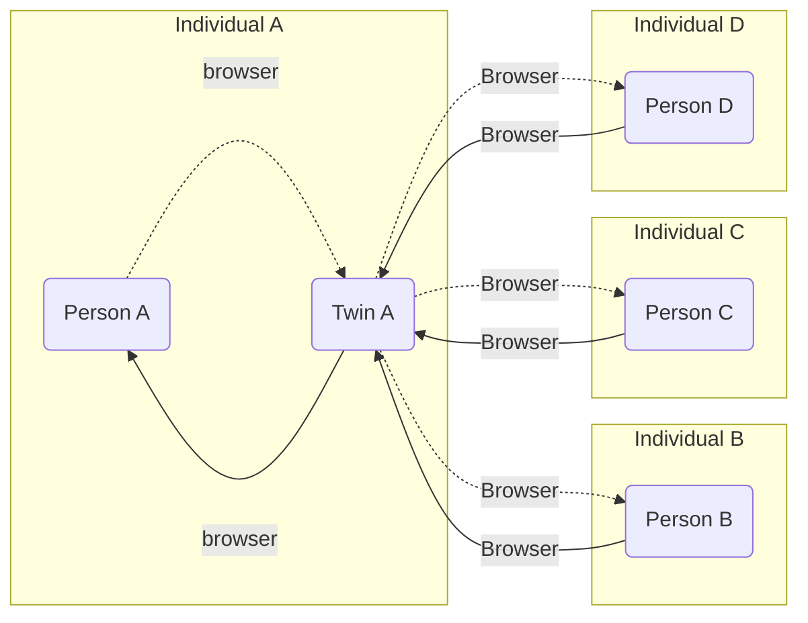

```mermaid
graph LR
    
    subgraph Individual A
    INDIVIDUALA(Person A)
    INDIVIDUALA .->|browser| TWINA
    TWINA -->|browser| INDIVIDUALA
    end
    TWINA(Twin A) .->|Browser| INDIVIDUALB
    TWINA(Twin A) .->|Browser| INDIVIDUALC
    TWINA(Twin A) .->|Browser| INDIVIDUALD
    subgraph Individual B
    INDIVIDUALB(Person B) -->|Browser| TWINA
    end
    subgraph Individual C
    INDIVIDUALC(Person C) -->|Browser| TWINA
    end
    subgraph Individual D
    INDIVIDUALD(Person D) -->|Browser| TWINA
    end

```