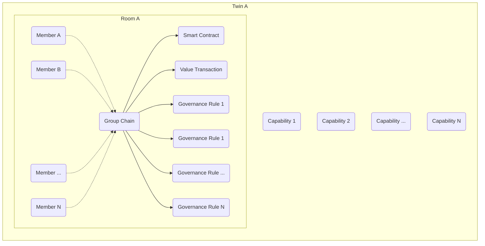

```mermaid
graph LR
    subgraph Twin A
    Capability1(Capability 1)
    Capability2(Capability 2)
    Capability3(Capability ...)
    Capability4(Capability N)

    subgraph Room A
    

    INDIVIDUALA(Member A)
    INDIVIDUALB(Member B)
    INDIVIDUALC(Member ...)
    INDIVIDUALD(Member N)

    CHAIN(Group Chain)

    INDIVIDUALA .-> CHAIN
    INDIVIDUALB .-> CHAIN
    INDIVIDUALC .-> CHAIN
    INDIVIDUALD .-> CHAIN

    SC(Smart Contract)
    VT(Value Transaction)
    GR1(Governance Rule 1)
    GR2(Governance Rule 1)
    GR3(Governance Rule ...)
    GR4(Governance Rule N)
    CHAIN --> SC
    CHAIN --> VT
    CHAIN --> GR1
    CHAIN --> GR2
    CHAIN --> GR3
    CHAIN --> GR4
end
end

```