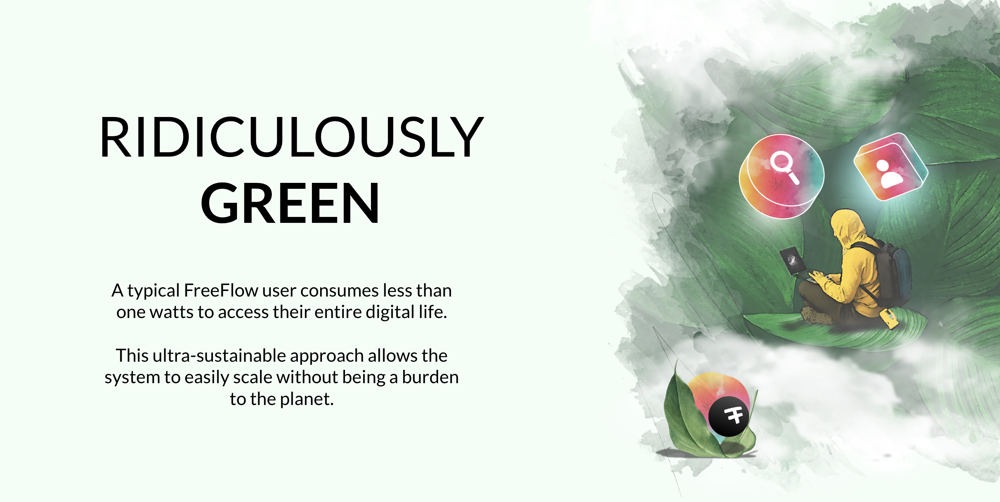

# Buy CHI

  

CHI is the utility token of the Freeflow Ecosystem.

It corresponds to Internet (storage, compute, network) capacity on the FreeFlow network and can be used to buy services on the FreeFlow Network.

> CHI are only the result of people farming (*)

## How can I buy CHI?

### Method 1, use USDC on Algorand Network

> price for 1 CHI = 0.1 USD (**)

**IMPORTANT**

> The price of CHI should go up in relation to the amount of farming and TWINS in the field.

**how**

- install Algorand wallet (we recommend https://perawallet.app/)
- buy algo to get your Algorand wallet minimally funded (10 USD or so is ok)
- buy USDC on algorand (can swap from other currencies, buy from credit card, ...)
- buy CHI, visit our CHI buying page (coming soon).
- CHI will now be in your wallet.

### Method 2, use your TFT

> price for 1 CHI = 2 TFT (***) (see www.threefold.io to get TFT).

You need some TFT, there are quite some ways how to buy TFT, e.g. there is gettft.com

**how**

- install Algorand wallet (we recommend https://perawallet.app/)
- buy algo to get your Algorand wallet minimally funded (10 USD or so is ok)
- go to our CHI buying page, ask for QR code 
- go to your ThreeFold Connect wallet, scan the QR code, TFT will now be send to the FreeFlow treasury and CHI will be returned to your wallet.
- CHI will now be in your wallet.

## Remarks

(*) CHI can also be bought with TFT, TFT is the token as created by farming on the ThreeFold grid, ThreeFold grid is the underlying network we use for FreeFlow, a Threefold farmer can exchange to CHI at the rate of the day (now 2 TFT for 1 CHI). This means every CHI is the result of farming !!!

(**) When you buy using USDC, the treasury will use this USDC to buy TFT and then switch to CHI. There are no CHI minted !!! The price of TFT and CHI will change over time.

(***) The exchange rate between CHI and TFT is defined regularly by the DAO to be market conform. We start with 1 CHI = 2 TFT.

  

{{#include disclaimer.md}}

