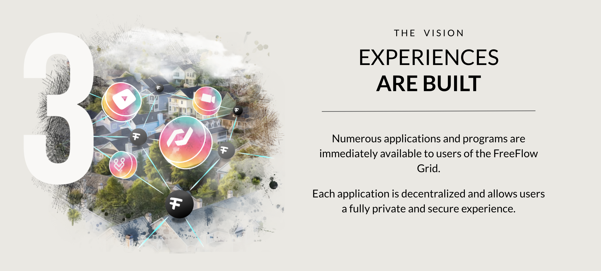
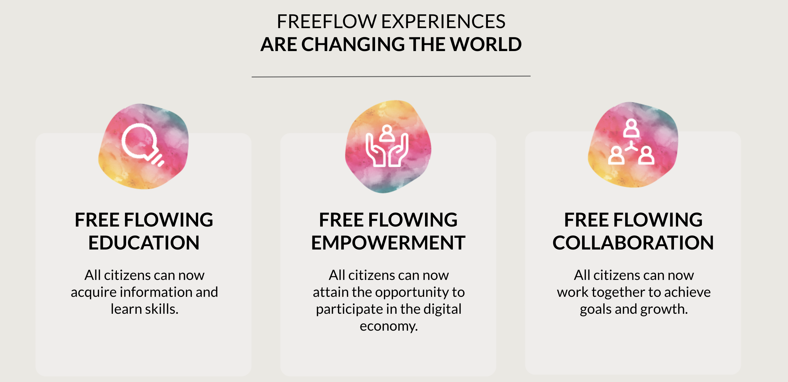

# My Experiences

  

- [OurLife](ourlife/ourlife.md) : Q1 2023
    - = the starting point of our digital life
    - Alternative to Google Docs, Whatsapp, Zoom, ...
- [OurVerse](ourverse/ourverse.md) : Q1 2023
    - = incredible metaverse which will provide alternative to google search & maps as well
- [Sikana](sikana/sikana.md) : Q1 2023
    - = incredible educational platform
    - billions of views already, 2000 video's online (today on youtube will move to freeflow netqwork)
- [Floweavers](floweavers/floweavers.md) : Q2 2023
    - = apps for a sharing economy (+100.000 users already)

The freeflow system is different, you are in the center of your digital life.

We made a funny comparison with our real life, [read here](../../ourtwin/intro/internet_sovereignity.md)

  

