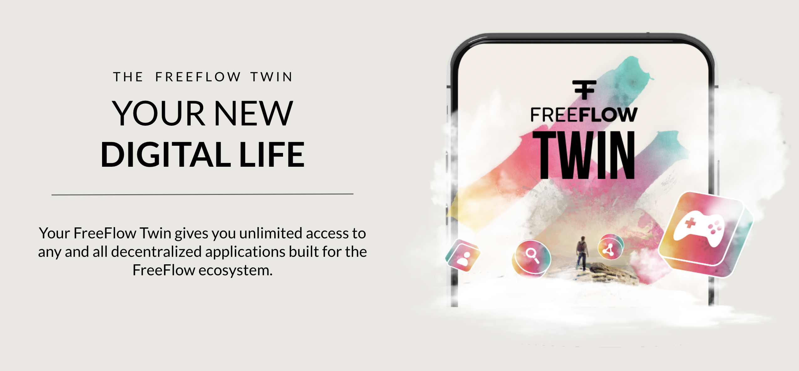
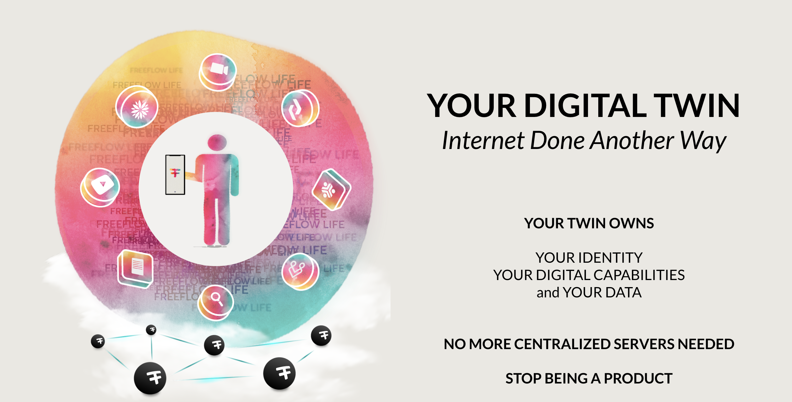
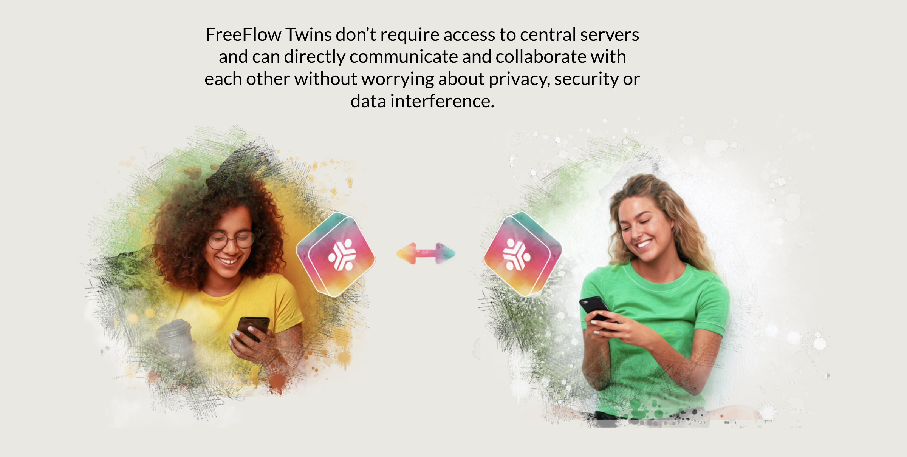

# How Does It Work

  

You get a digital twin, which is your personal application running on a location of your choice in the FreeFlow Network. Each twin is owned by only 1 owner. The Twin has lots of capabilities and serves its owner 24h a day, 7/7.

Experiences are being built which use the capabilities of the twin.

  

A twin owns your data and your identity. All data is stored in such a way it can never be corrupted or lost. You own your data, identity and your digital skills for all your life.

When you die you can handover your digital remains to your beloved ones.

Each Twin has following capabilities:

  

Twins are unique they talk directlty to each other, there are no centralized datacenters or server farms needed.

  

>TODO: need to explain how we can farm for people around us, and make money that way, also how we need this money to buy the services.