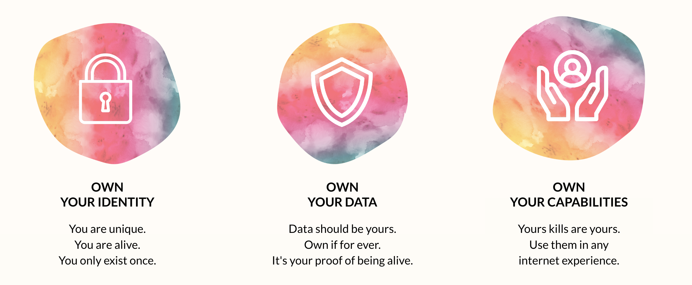

# Internet Sovereignity

  

In the current internet system I exist many times, each application provider owns my data and provides functionality they own and let me use in return for my data.

We are sovereign:

- I am me, I am sovereign, I am capable of making my own decisions.
- I have an identity, I do exist, I want to be able to control my own destiny.
- What I learn and experience is mine. 
- I do not exist for the benefit of others. 
- I have my own digital skills and capabilities, these are owned by me.
- Everything I produce is owned by me, and stored by my twin on locations me and my twin know about.
- Because the capabilities are owned by me then can easily be extended and I can use them everythere, it makes my life easier, I don't have to learn different tools each time I enter another event.

## Lets compare this to real life.

To make this more tangible, lets compare a digital experience with a real life one like going to an educational event.

### The Web 2 way

- I go to a educational event. Its very affordable, maybe even free.
- They ask me to change clothes and use theirs, so we all look alike.
- I am not allowed to bring or use my own tools. They give me theirs like a pen, headset, glasses, a notebook all of this I am asked to return at the end.
- The event creators keep my freedom limited and overwhelm me with audio/video experience, if I am allowed to chose its all based on their scripts
- They drive me around from activity to activity in the experience, its all very well done and impressive.
- They track everything I do, to make sure they can adjust the experience to have me even more impressed next time, because they want me to come back.
- If I take notes its on their notebook, but I can't take it with me, if they destroy it its gone.
- I am happy, because its all incredible and very well done
- I take the commercial content for granted because yeh, you know I got this for a low cost, they need to make money too.
- If I want to get back to the content of the event, I need to pay again and go through the event again.
- If I would go to another (similar) event from another provider, I would have to restart from scratch, I get other tools, another notebook, I cannot reuse what I have produced on the first event.

But the good thing is, I don't have to think that much and its very addictive, they learn very well what we like and keep on improving constantly, so we wanna come back. 

### The Web 3 way

- All as above, but the event is not owned by 1 company but by all of us.
- We have a vote in how the event should be created
- Its at least better because if working properly its a consensus owned experience.
- Now at least we have the feeling we co-own how the event is being created.
- We will realize its all very hard to run a real democracy.

### The Web 4 or Web Remade way

- I go to the education event.
- They check if the tools I have are up to date for the experience they have created. If not they tell me where I can get new tools (upgrade them), but they remain mine. These tools are my core digital capabilities or skills.
- I can now go into the event and experience the experience as prepared for me, I walk freely around, I take notes on my notebook, so I can use it later.
- I have a lot of freedom where to go, in which order to experience.
- I can use many more of my capabilities, and I don't have to learn new ways how to do something, because the tools (capabilities) are mine. I can dance, sing, run, jump, ...
- I will be able to do things the creators of the event did not foresee, there is so much joy and freedom, I am creative, I am alife.
- Its easier to make friends, because I can bring my friends in much more easy ways, because they already have the required capabilities.
- I can give authenticity to the experience, my feedback matters from out of my own power.
- It might be I have to think and act more myself, I am using my tools (capabilities) in the incredible experience as created by the education event organizers.
- I will be super happy because I feel empowered, I am less addicted maybe because less controlled, but I know whatever I learned is for me to keep, I felt productive because I was allowed to use my capabilities and my data was enriched.

> PS: This event can be single owned or co-owned (like in web3).

Doesn't this sound like a better idea, don't we wanna have a tool which works that way?

