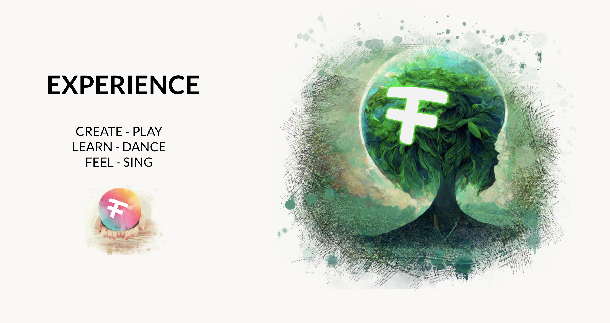

## Experience Life

  

There are many ways how to experience life, in the real and digital world.

Right now we are so used to the current web 2 way, which is rather one-dimensional where we are the spectator and participant but not the driver.

Lets see what else is possible:

### The Web 2 way

- I go to a educational event.
- I get naked and am not allowed to bring/use my own tools.
- They give me their clothes, glasses and notebook all of this I am asked to return at the end.
- The event creators keep my freedom limited and overwhelm me with audio/video experience, if I am allowed to chose its all based on their scripts
- They drive me around from activity to activity in the experience, its all very well done and impressive.
- They track everything I do, to make sure they can adjust the experience to have me even more impressed next time, because they want me to come back.
- If I take notes its on their notebook, but I can't take it with me, if they destroy it its gone.
- I am happy, because its all incredible and very well done
- If I want to get back to the content of the event, I need to pay again and go through the event again.
- If I would go to another (similar) event from another provider, I would have to restart from scratch, I get other tools, another notebook, I cannot reuse what I have produced on the first event.

### The Web 3 way

- All as above, but the event is not owned by 1 company but by all of us.
- We have a vote in how the event should be created
- Its at least better because if working properly its a consensus owned experience.

### The Web 4 or Web Remade way

- I go to the education event.
- They check if the tools I have are up to date for the experience they have created. If not they tell me where I can get new tools (upgrade them), but they remain mine.
- I can now go into the event and experience the experience as created for me, I walk freely around, I take notes on my notebook, so I can use it later.
- I have a lot of freedom where to go, in which order to experience.
- I can use many more of my capabilities, and I don't have to learn new ways how to do something, because the tools (capabilities) are mine. I can dance, sing, run, jump, ...
- Its easier to make friends, because I can bring my friends in much more easy ways, because they already have the required capabilities.
- I can give authenticity to the experience, my feedback matters from out of my own power.
- It might be I have to think and act more myself, I am using my tools (capabilities) in the incredible experience as created by the education event organizers.
- I will be super happy because I feel empowered, I am less addicted maybe because less controlled, but I know whatever I learned is for me to keep, I felt productive because I was allowed to use my capabilities and my data was enriched.

> PS: This event can be single owned or co-owned (like in web3).

