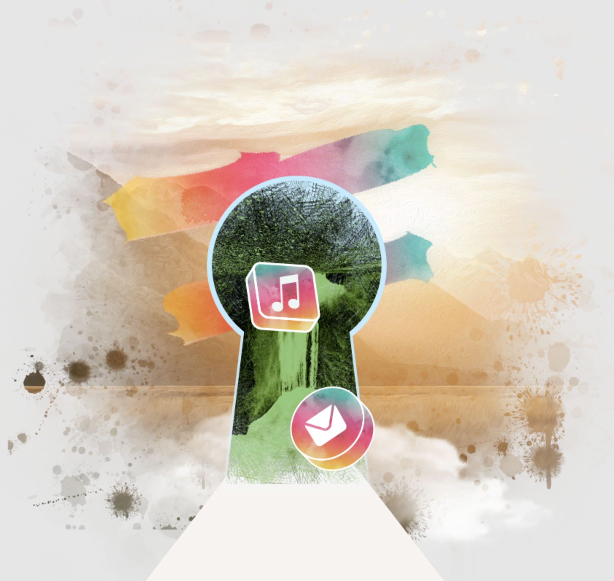

# FreeFlow Key

A FFK is your key which gives access to a FreeFlow Twin.

You need one to benefit from all the FreeFlow experiences (now and in the future).

 

**The value of a digital life today per year is +10.000 USD (as estimated by some marketing companies) but in reality it's much higher, FreeFlow DAO is selling 1m FreeFlow Keys at 200 to 60 USD per FreeFlow key for a lifetime.**

 
 
 
 
 

By having an FreeFlow Key you get following direct benefits

- All skills and experiences as mentioned in this document.
    - Many more experiences being built, we will have everything required to allow you to have a safe & private internet experience as complete as everything you have access to today.
- Access to endless amounts of information free of charge (education, knowledge).
- The ability to exchange anything for everything (money to money, money to service, money to goods, …) directly from supplier to buyer. This gives you at least 3x more buying power compared to today.
- Ability to keep your data safe for ever.

The value of this is huge, there are 2 ways how to get to an FreeFlow Key

- You can rent a FreeFlow Key: 5 USD worth of CHI per month (not possible yet)
- You can buy a FreeFlow Key: 200-60 USD worth of CHI, lifetime valid

> See [here](../buy/buy_my_twin.md) for more information about how to buy a FFK.

FFK are digital assets as stored on the Algorand blockchain.

## Tokenomics

- There are only 1.000.000 FFK's in the ecosystem.
- FFKs are the alternative to a license fee for having access to technology
    - 30% of the sales goes to ThreeFold (see www.threefold.io) to keep on further creation of the tech.
    - 70% goes to the FreeFlow Treasury of the FreeFlow DAO which will use to fund the growth of ecosystem.
- FFK's can only be bought by [CHI's](chi.md), see [here](../buy/buy_my_twin.md)
- CHI's can only be farmed or bought with TFT (the utility token of ThreeFold).
- FFKs can be rented from the Freeflow DAO or any FFK holder at a to be defined price (prob around 5 USD per month). 
- If there are not enough FFK available for rent, then the DAO can create FFK's for rental only purpose and owned by treasury.

## Relation to CHI

> Price of CHI at start is 0.1 USD. CHI is the utility token of freeflow and represents Internet Capacity on the ThreeFold grid. CHI is created by [FreeFlow Farmers](../farming/farming_intro.md). You can buy CHI from the Algorand Blockchain. Be aware that the price per FFK in CHI will be variable over time as CHI price changes in USD.

Each CHI links into the ThreeFold Token called TFT, at this stage the currency exchange rate is 0.5 CHI corresponds to 1 TFT. Every TFT holder can exchange their TFT for CHI at this rate, or the other way around. ThreeFold is the capacity layer on top of which FreeFlow has been built.

## Internet Resources Available for a FFK Enabled Twin

A FreeFlow Twin linked to a FFK has following default resources available for the first 1 year: 0.1 CU and 0.1 SU. All additional resources used or after the first year the twin owner has to use his/her CHI to pay the energy fees (storage, compute and network). All the capabilities are for free for ever and all upgrades as developed by FF will remain free of charge as well.