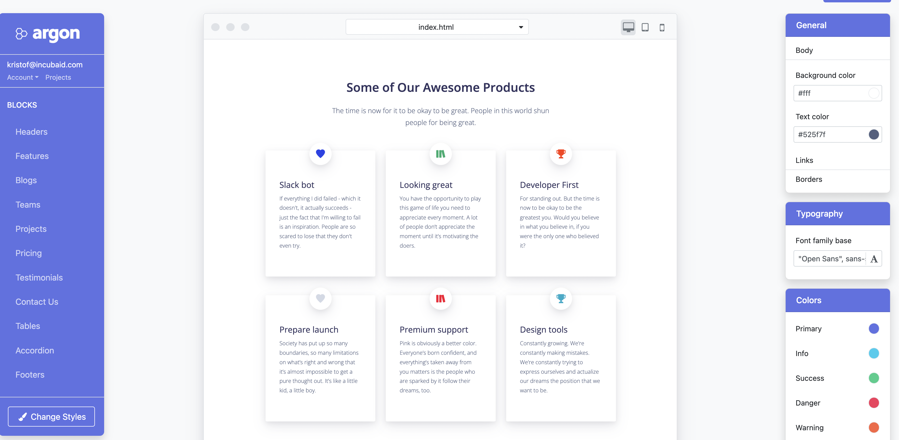

# create and publish a website

We have created some amazing capabilities to create websites starting from our coding development environment.

One of the tools we see a lot of potential in is:

  

to provide the best possible experience for you to migrate websites onto FreeFlow Network.

We support

- any website, but some work might be needed to port, see below for help.
- mdbooks e.g. https://threefoldtech.github.io/devxdao_grant/tech, a cool way to create ebooks
- wiki knowledge bases e.g. https://library.threefold.me, a powerful way how to organize your content in searcheable knowledge base.

## Indexing

FreeFlow gives you the ability to submit your website to the FreeFlow Indexing service, you can define your own search criteria.

Everyone looking for the right information will receive unbiased information.

  

## coming in Q4 2022: assisted migration

You will be able to use your CHI tokens to ask help from someone from our community to migrate your website to the FreeFlow Network, providing for the best possible web and search experience.

## coming in 2023 : graphical web builder

We are working on graphical web builders as well.

  

  