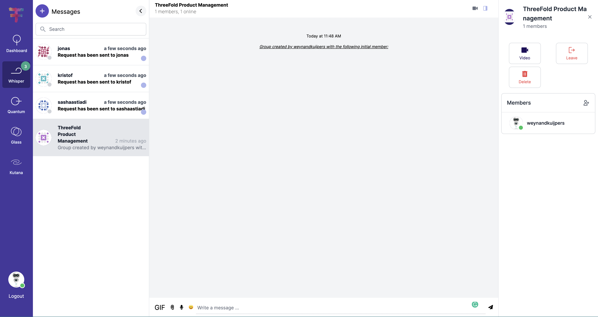

## Communication tool: Chat

The chat communication tools presents a simple interface to manage individual and group messaging. The interface presented is very similar to mainstream messaging platforms but works in a very different way.

Centralized messaging service always have a third party (company) involved.  A message would follow the following path:

```mermaid
graph LR
    subgraph Individual A;
    INDIVIDUALA(Person A);
    end;
    INDIVIDUALA .->|browser| MESSAGINGA;
    MESSAGINGA -->|browser| INDIVIDUALA;
    subgraph Messaging provider;
    MESSAGINGA(messaging platform);
    end;
    INDIVIDUALB(Person B) -->|browser| MESSAGINGA;
    subgraph Individual B;
    MESSAGINGA .->|browser| INDIVIDUALB;
    end;
```

The problem here is that the messaging provider sits in the middle and has access to all messages passing through its messaging platform.  This also means that messaging providers can (or can be told to) do the following:
- do machine learning on message content and/or message volume, frequency, size and all sort of other data.
- expose, compile and sell machine learning outcome (metadata)
- provide access to meta data or actual messaging information to other companies or governing bodies
- and much, much more.

There are numerous documentaries and news stories out there that prove that this is the case. A decentralized messaging platform avoids all of this

Decentralized messaging sends and receives messages from private messaging instances to the receiving party's private (messaging) instance.  It does not have a central man in the middle. There are two main types of decentralized messaging in this capability:
- _private chat_: private entity to private entity
- _group chat_: one private entity creates and **hosts** the "group" and all the other members are invites to post and receives message from this group.  The entity that starts the group also sets the groups "rules"

### Private Chat
With private chat we mean a chat between to entities. These entities could be individuals, organizations, companies, clubs, basically anything.  The chat is a one to one chat and information (data) is exchanged between two private, secure and personal messaging platforms.
- a chat starts with inviting the other persons twin (messaging and other services platform ).  In this case the twin of the other person needs to be found and sent an invite message.
- if the person accepts the invite a secure connection allows messages to be send person to person without a third party in the middle.  Only the (twins of) two people involved has access tot he message data (and metadata)

<!--
mermaid source code in ./includes/private_chat.md
-->

```mermaid
graph LR
    
    subgraph Individual A
    INDIVIDUALA(Person A)
    INDIVIDUALA .->|browser| TWINA
    TWINA -->|browser| INDIVIDUALA
    end
    TWINA(Twin A) .->|secure network| TWINB(Twin B)
    subgraph Individual B
    TWINB .->|browser| INDIVIDUALB
    INDIVIDUALB(Person B) -->|Browser| TWINB
    TWINB -->|secure network| TWINA
    end
```

The chat functionality allows most (if not all) of the standard functionality know from many centralized platforms:
- send text message
- send voice message
- message reply
- message forward
- send photo/file/

From the chat function you can also initiate video conference, and have control over accepting, deleting and blocking users.

### Group Chat

Group chat is unique to this peer to peer chat platform.  The group functionality is initiated by the group creator and this action creates the group function on the initiators messaging platform (twin).  The group is then formed by inviting other entities and when they accept they get read and write access in the group messaging functionality.

```mermaid
graph LR
    subgraph Individual A
    PERSONA(Person A) --> TWINA
    TWINA --> PERSONA
    TWINA(Twin A) --> GROUP(group)
    GROUP .-> TWINA
    end
    GROUP .-> TWINB
    subgraph Individual B
    TWINB(Twin B) --> GROUP
    TWINB --> PERSONB
    end
    PERSONB(Person B) --> TWINB
    subgraph Individual C
   GROUP .-> TWINC
    TWINC(Twin C) --> GROUP
    TWINC --> PERSONC
    end
    PERSONC(Person C) --> TWINC
       GROUP .-> TWIND
    subgraph Individual D
    TWIND(Twin D) --> GROUP
    TWIND --> PERSOND
    end
    PERSOND(Person D) --> TWIND
```

### Look and feel in a browser

