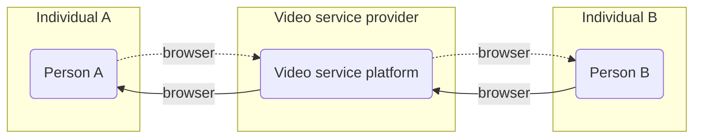
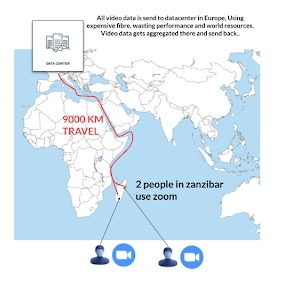
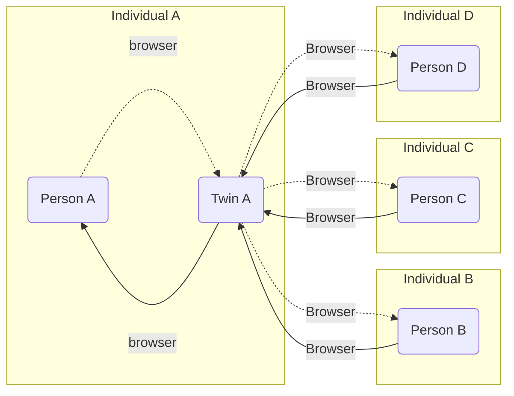
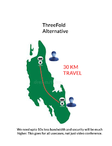

## Communication tool: Video

A truly peer to peer video chat experience starting from your digital twin to your guests', without stopping by a data center in between. Of course, free.

Current world video conferencing services use service provider and centralized software installations to present services to businesses and consumers.  Take for example to users in Zanzibar that wish to communicate through zoom (or google meet, or Microsoft Teams, principle stays the same).  The will connect from their laptops/phones to a centralized service and the traffic will be routed from both of their devices to a centralized service datacenter far away.

In principle this looks like

And if we expand this to a world map it would look somethingg like this:

<!--
mermaid source in: ./includes/centralized_video.md
-->

)

>TODO: pictures are too small, need to make new ones, also revisit text & flow

This does not lead to create the best experience and over all, it is very wasteful with a number of (scarce) resources.

The solution to this problem is to have a video conference solution that works peer to peer.

<!--
mermaid source in: ./includes/private_video.md
-->

>TODO: not ok

If we build a video conferencing system that follows this principle we can be much more effective.  Back to the example earlier the two people in Zanzibar would be able to communicate as follows:

### 

#### Video Conference features

- 1. 
- 2. 
- 3. 

>TODO: 