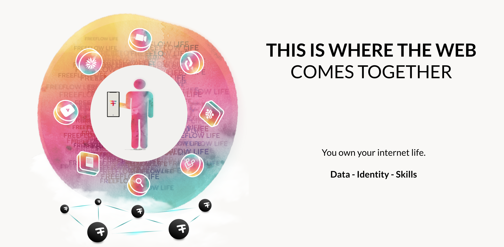
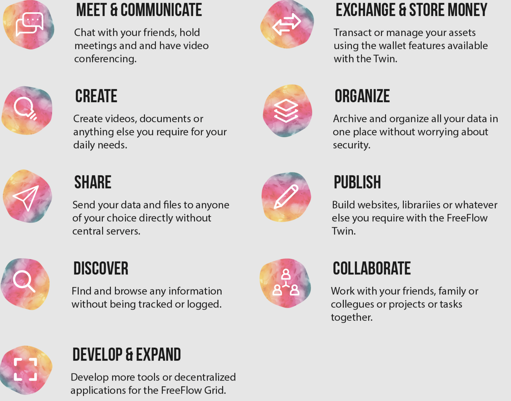

# My twin has many skills.

  

I am powerful and have many skills, these skills are used when we enter in an experience.

This is a very different paradigm compared to current web or mobile applications where the capability is owned by the provider of the application.

I am powerful and can use my skills wherever I go.

- [Communicate](communicate.md)
- [Create](creativity/creativity.md)
- [Share](share.md)
- [Discover](discover.md)
- [Develop](develop.md)
- [Exchange](exchange.md)
- [Organize](organize.md)
- [Publish](publish.md)
- [Collaborate](collaborate.md)

Our twins represent us in our digital life and have following skills:

 
 

 
 
 
 
 
 
 
 
 
 
 
 
 
 
 
 
 
 
 
 
 
 
