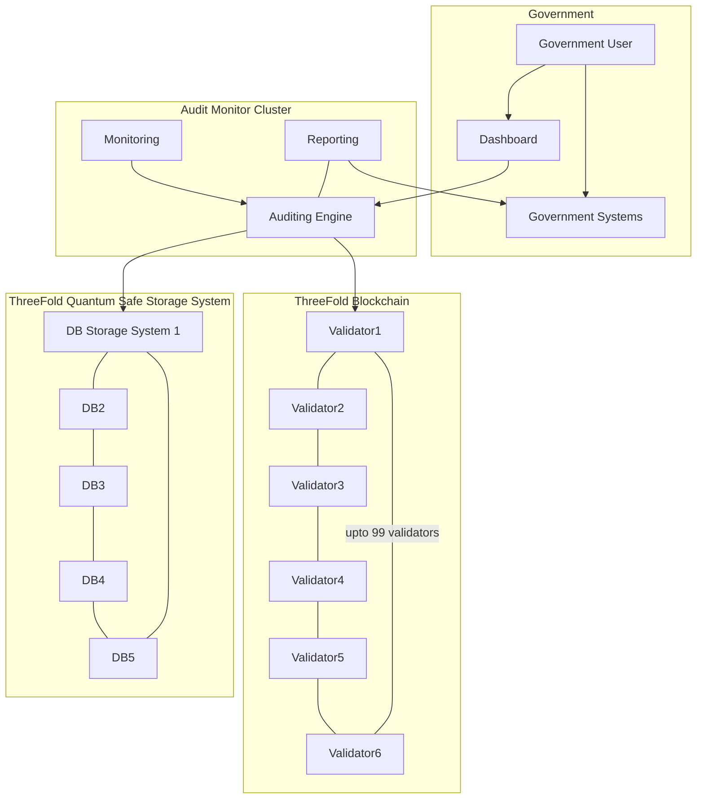

# Auditing and Reporting

All transactions as executed on the digital backbone get registered on a quantum safe storage system and the proofs on a blockchain system.

Strongly authenticated government users can access a dashboard web interface to consult the Digital Backbone Dashboard.

## Information Available To Government

- All registered companies & digital nomads.
- Payments as done of digital nomads towards the system.
- Outstanding invoices.
- If any tax is Due.
- Key Performance Metrics e.g. nr of users, growth over last months, average spending, ... 
