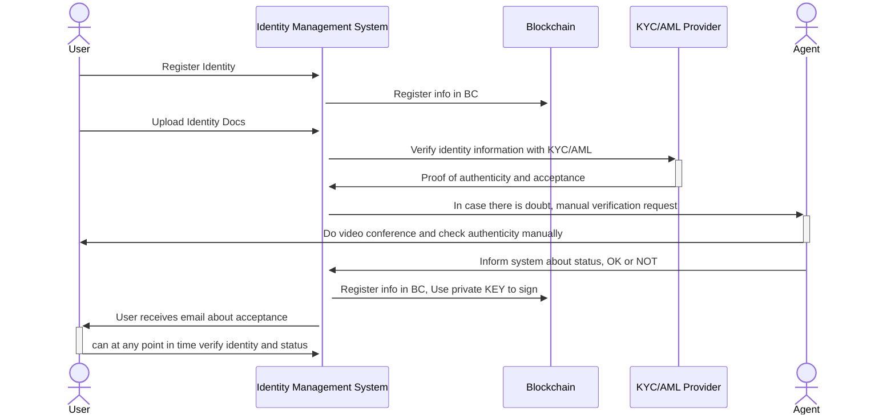
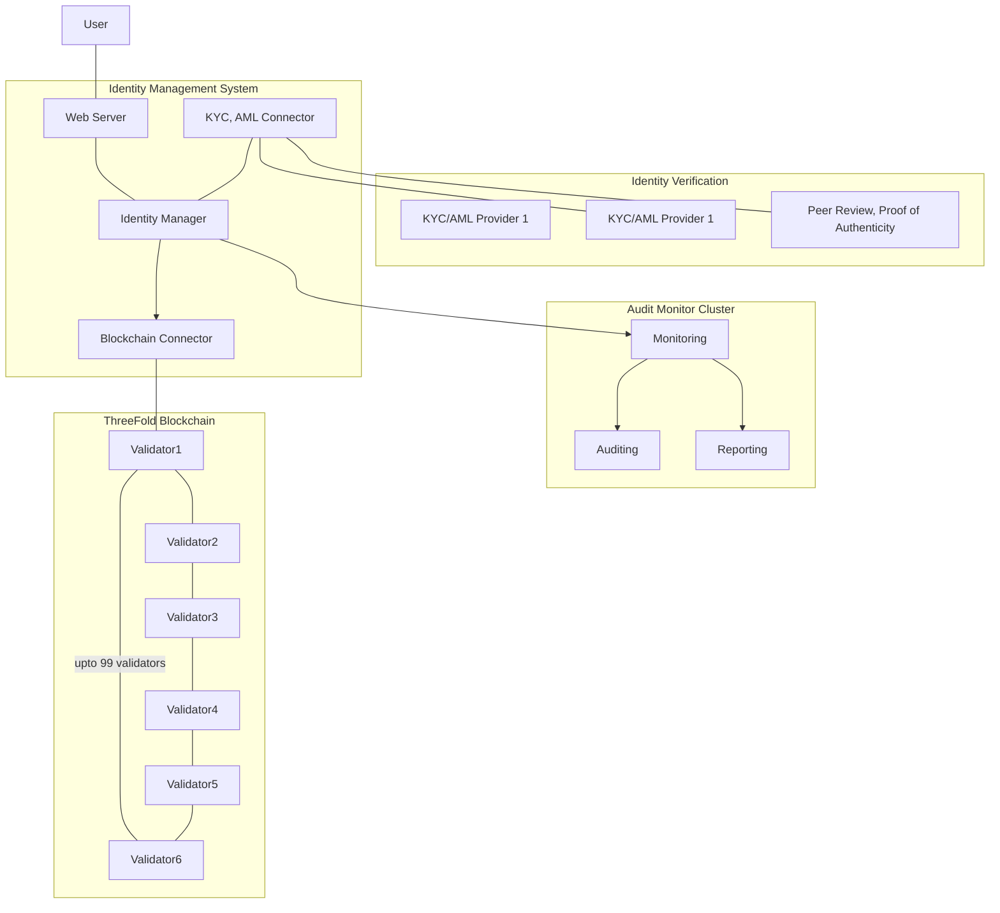

# Identity System

A user connects to our Identity management system using a web or mobile client.

- The user submits identity which gets stored in the blockchain system.
- The user will submit documents to the system
- The system will process the documents and use multiple identity verification systems to verify identity.
- Once every year the identity will be verified again against a AML = Anti Money Laudry list provider, to see that in mean time the user did not get black or gray listed.
- Once proof of authenticity and verification is positive, the proof is attached cryptographically to the user entry in the database. This allows all future systems to recognize that this user is ok to work with.

## Process

## Requirements

- No User will ever be allowed to do business unless proof of authenticity and identity succeeded
- No-one will be allowed to operate anonymously.
- All transactions as done for any operation by user is logged in the blockchain and connected to the monitoring system.

## Architecture

