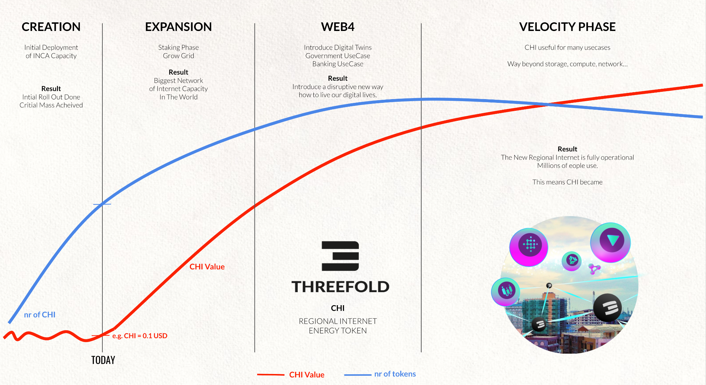

# CHI SCARCITY AND LIFECYCLE

CHI is the energy token of the ThreeFold Internet. CHI is scarce and valuable.

CHI Farmers who start at creation mode can farm upto 10x more CHI compared to someone who enters the ecosystem at the end of the expansion phase. 

This is because the CHI farming reward is locked in at the point when the 3Node gets registered and this is in line with the CHI price at that stage. Each Regional internet starts with a CHI price of USD 0.1, the first deployments will be locked for a CHI farming reward at USD 0.1. If in the expansion phase the CHI goes to e.g. 0.5 USD it means that farmers at that stage will get 5x less reward for the same investment.

### Creation Phase

* Initial farmers deploy enough capacity to make the TF Grid (Internet Capacity Network) large enough to support expansion by everyone.
* Initial farmers deploy the first 50 validators and have to stake Threefold Tokens for it and will also put initial liquidity in the Liquidity pool.
* All initial deployed capacity is certified and does not require staking. In this stage the CHI price will be rather low and fluctuate until the network is ready for expansion.
* The CHI generated are put into a liquidity pool of the regional internet, whoever needs CHI for Internet Capacity or for Staking in expansion mode can buy the CHI from the liquidity pool, this generates income for the early farmers and potential possibility of early liquidity (in FIAT currency e.g. USD).

### Expansion 

* New farmers will have to stake CHI to get rewards, the amount to stake is in line with the reward as well as certification level. Any home, government entity, university or commercial provider can deploy additional capacity to the grid by means of deploying 3Nodes.
* This requires a lot of CHI to be locked into the network, people will have to buy these CHI which means liquidity is being created.
* The network now grows autonomous to a much larger scale as compared to the creation mode.

### Web 4

* The picture is probably misleading, Web4 and Expansion goes in parallel.
* Web4 expansion means use cases are being deployed on the grid which require buying CHI, these CHI can be bought from the liquidity pool providing early liquidity for who wants to (in FIAT currency e.g. USD).
* This will create a lot of extra scarcity & utilization of CHI which means price goes up.

### Velocity Mode

* The grid is now fully established and lots of people are using it.
* Velocity (means liquidity) now goes up dramatically and the CHI now becomes liquid.
* Everyone can now choose when to convert CHI to USD in line with liquidity.
* We are now 100% operational, a new internet has been created which is fully independent, green, performant, local and secure.
