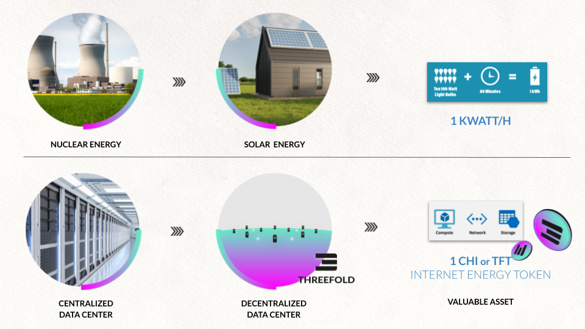

# Compare to Electricity Generation

* TFT and CHI are the Internet Energy Token which represents Internet Capacity (Storage, Compute, Network)
A TFT/CHI can be thought of like kwatth in electricity generation. CHI is generated by ThreeFold Farmers.

* Investors can buy an INCA (INternet CApacity) Certificate which is a digital certificate. An INCA is a certificate, which allows the owner to convert an INCA Certificate into a certain amount of TFT or CHI at a certain time from predefined parties (farmers).

| Energy Solar Panel Production | ThreeFold Internet Capacity Production |
| ----------------------------- | -------------------------------------- |
| Unit of generation            | = kwatth                               |
| Ownership Proof               | = shares in special purpose vehicle    |
| Liquidity                     | Low requires exit, or IPO              |
| Security                      | Backed by all assets.                  |
| Utility                       | Electricity Energy                     |
|                               |                                        |
| Expected ROI (per year)       | 5-12% IRR                              |