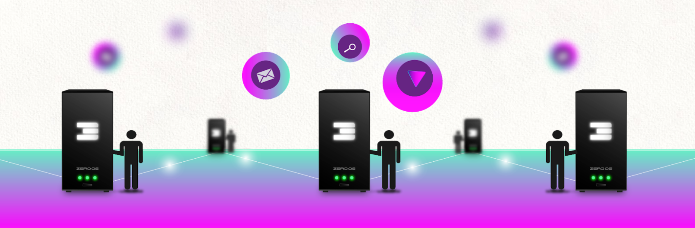
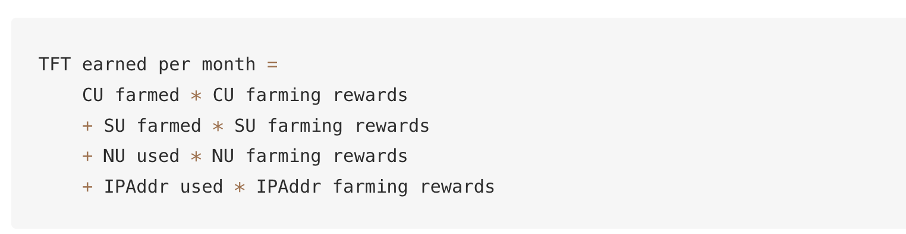
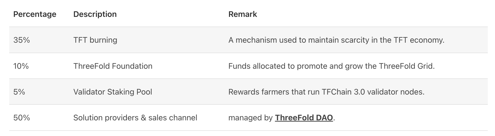

# CHI = INTERNET ENERGY TOKEN DETAILS

* CHI = Internet Energy Token = is like kwatth for electricity
* 1 CHI presents compute storage, network capacity in the ThreeFold Network
* The first CHI token created was called TFT and represents Internet Capacity on the original ThreeFold grid.

## Farming = the creation of the tokens

Each [3Node](https://library.threefold.me/info/threefold#/tfgrid/farming/threefold__3node) (a part of an edge datacenter) has certain amount of compute, storage and network resources:

* Compute Capacity (CPU)
* Memory Capacity (RAM)
* Storage Capacity (SSD/HDD)
* Network Capacity (Bandwidth, IP Addresses)
For making this Internet Capacity available, Farmers are rewarded with CHI.

The amount of resources available in a [3Node](https://library.threefold.me/info/threefold#/tfgrid/farming/threefold__3node) are translated into compute units (CU), storage units (SU), Network units (NU) and IP addresses (IPAddr) to calculate farming rewards. See also [Cloud Units Calculation For Farming](https://library.threefold.me/info/threefold#/tfgrid/farming/threefold__resource_units_calc_cloudunits).

## Utilization = the use of the tokens = the utility

1. A user reserves Internet capacity on a given set of [3Nodes](https://library.threefold.me/info/threefold#/tfgrid/farming/threefold__3node).
2. [Zero-OS](https://library.threefold.me/info/threefold#/tfgrid/farming/threefold__zos) records the reserved and used CU, SU, NU and IPAddresses in correlation with [TFChain](https://library.threefold.me/info/threefold#/tfgrid/farming/threefold__tfchain) records.
3. The [TFChain](https://library.threefold.me/info/threefold#/tfgrid/farming/threefold__tfchain) [DAO](https://library.threefold.me/info/threefold#/tfgrid/farming/threefold__dao) will charge the costs to the user in line with the [discount mechanism](https://library.threefold.me/info/threefold#/tfgrid/farming/threefold__staking_discount_levels).
4. CHI from the user account are burned/distributed in line to the table below.

The burning makes sure that eventually more tokens will be burned compared to created.

