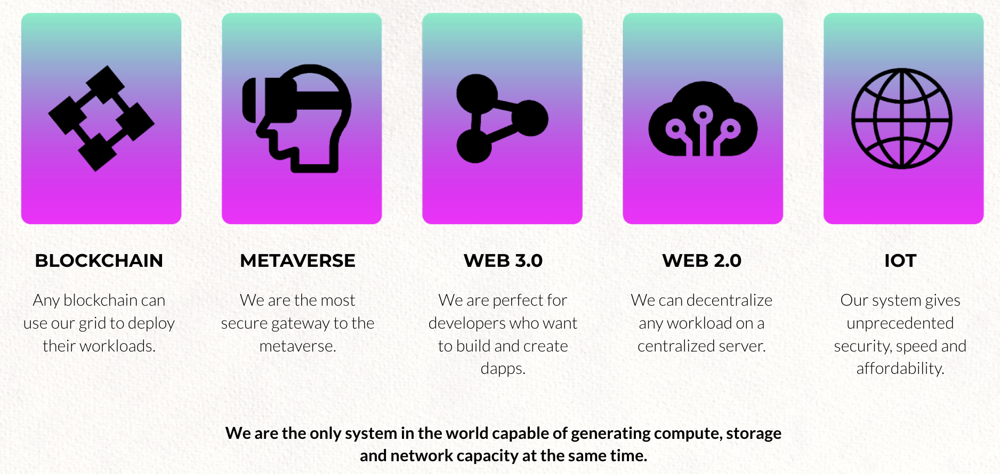

# The ThreeFold Grid Is Usable

Not only this returns profit for the investor but as important is that the Internet Capacity generated is usable for many different use cases and provides prosperity for the country which gets their own Regional Internet.  

A regional Internet created by the genesis farmers and financially supported by the INCA investors is able to function on its own.  The capacity created inside such a regional setup presents sovereign capacity carrying regional workloads without dependency on anything outside resulting in  true independence and resilience for that region.
