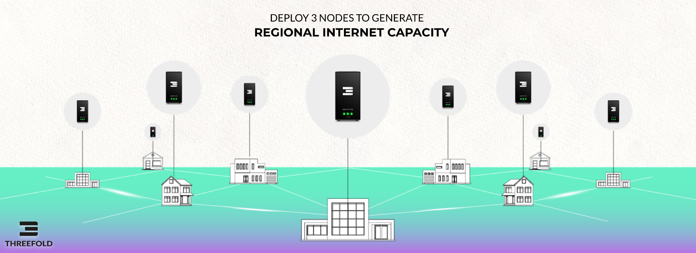

# INCA = The Token fueling INternet CApacity Generation 

INCA Farmers (Edge Datacenters) generate Internet Capacity (Storage, Compute and Network). The INCA Farmers are rewarded tokens for doing so, TFT or the local CHI is like a kwath for electricity but in this case it does represent internet capacity.

# 

There are many drivers why CHI will be scarce per regional Internet, some more info further in this document.

## INCA INVESTMENT BEST OF BOTH WORLDS

As an INCA investor I have the best of both worlds, I get a modern investment instrument which is protected by blockchain, real assets (edge datacenters) and legal documents as well as a known understood financial instrument called Sukuk.

This Investment Instrument INCA represents the digital gold of the future = Internet Capacity and is backed by the technology of an exciting technology company called ThreeFold who has already a lot of capacity deployed in many countries.

## THE INCA FARMER generates CHI or TFT and is super valuable

A CHI is a valuable token which has real utility and can be exchanged for USD and TFT which is the reserve currency for the full ecosystem. The TFT/CHI is needed for people to buy Internet Capacity as hosted on this network. This token system allows for a great economical model.

**PLEASE DO NOTE: we can deploy INCA projects in such a way that the customers (users of capacity) and or suppliers have nothing to do with Digital currencies. We can park all of this in an SPV which will deal with the fiat currency to token and back conversion.**

