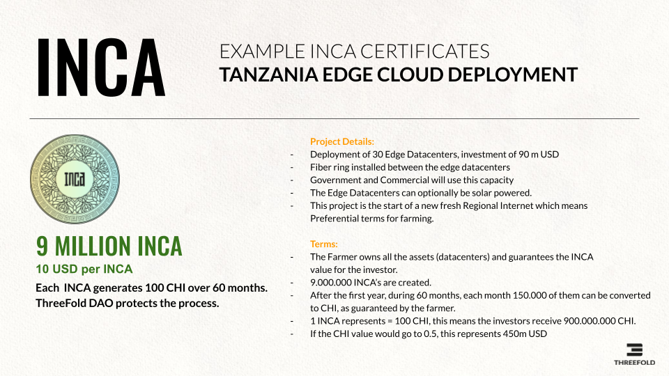

# EXAMPLE INCA PROJECT: 90M USD EDGE DATACENTER DEPLOYMENT TANZANIA 

This project will deploy 30 edge datacenters. Each edge datacenter generates CHI Tokens (CHI represent energy) which represent compute, storage and network capacity (think about it like kilowatt/h in electricity power generation facilities).

The earlier in the life cycle of ThreeFold a farmer generates capacity the more ThreeFold Tokens will be created (farmed/mined). The investor of those datacenters has INCA Certificates to prove ownership and receives the CHI as they are being farmed over time.

An investment of 90m USD has the potential to return 450m USD or more, this is possible thanks to the unique structure of the ThreeFold grid and how we generate INternet CApacity.

