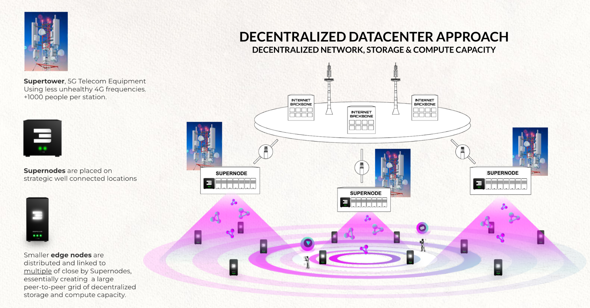

# EDGE INCA GENERATORS AS COMPLEMENT TO CENTRALIZED DATACENTERS

INCA stands for INternet CApacity (storage, compute and network) and is today mainly delivered from out of large centralized datacenters, which were and still are fundamental for the further internet growth, but this is not enough; we believe they need to be complemented by quantum safe edge datacenters.

**together we can deliver an decentralized internet capacity datacenter approach which is more:**

* safe
* war proof (see what happened with Ukraine), we are much more decentralized.
* scalable (billions of users are possible)
* more bandwidth efficient (closer to where the users are)
* cost effective and green
* potentially carbon neutral

# QUANTUM SAFE EDGE DATACENTER CONCEPT

ThreeFold has created super efficient **IN**ternet **CA**pacity generation technology. This INternet CApacity is compute, storage and network capacity which is green, secure, sovereign and private. This capacity layer is compatible with +- all workloads which would otherwise run in a centralized datacenter.

The 3Nodes are the efficient INCA generators and can be deployed in homes, offices, buildings, parking spots or deep down in basements or even vaults or bunkers. This allows for the creation of a super secure decentralized datacenter approach.

A node can be as small as a 1.000 USD cost box or as expensive as 50.000 USD per node.

The nodes can be connected over a multitude of networking technologies and even a combination, our technology is capable of looking for the shortest path in relation to connectivity on top of existing infrastructure. The network layer inside a Quantum Safe Virtual Datacenter is end2end encrypted and private. If somewhere an internet connectivity path is broken, the technology will look for alternative paths automatically, this happens without having to use Internet Routing protocols which might be too slow and possibly not secure enough.

## Scalable INCA Super Node Approach

The Edge datacenter concept is able to create and deliver mainstream datacenter services from non datacenter locations, at the so called edge.  However at the edge there might not be all the needed (technical) components to create and operate internet services equal to what can be done in the super nodes. 

# 

## Quantum Safe Decentralized Datacenter Benefits

## Quantum Safe Decentralized Datacenter Technology

More information in [https://threefoldfoundation.github.io/books/technology/](https://threefoldfoundation.github.io/books/technology/) 

There are 3 major parts to it

* Zero-OS = our own low level operating system providing compute capabilities
* Quantum Safe Storage System
* Planetary Network = an overlay end2end encrypted network layer

# INCA = The Token fueling INternet CApacity Generation 

INCA Farmers (Edge Datacenters) generate Internet Capacity (Storage, Compute and Network). The INCA Farmers are rewarded tokens for doing so, TFT or the local CHI is like a kwath for electricity but in this case it does represent internet capacity.

# 

There are many drivers why CHI will be scarce per regional Internet, some more info further in this document.

# THE INCA FARMER generates CHI or TFT and is super valuable

A CHI is a valuable token which has real utility and can be exchanged for USD and TFT which is the reserve currency for the full ecosystem. The TFT/CHI is needed for people to buy Internet Capacity as hosted on this network. This token system allows for a great economical model.

**PLEASE DO NOTE: we can deploy INCA projects in such a way that the customers (users of capacity) and or suppliers have nothing to do with Digital currencies. We can park all of this in an SPV which will deal with the fiat currency to token and back conversion.**

# Compare to Electricity Generation

* TFT and CHI are the Internet Energy Token which represents Internet Capacity (Storage, Compute, Network)
A TFT/CHI can be thought of like kwatth in electricity generation. CHI is generated by ThreeFold Farmers.

* Investors can buy an INCA (INternet CApacity) Certificate which is a digital certificate. An INCA is a certificate, which allows the owner to convert an INCA Certificate into a certain amount of TFT or CHI at a certain time from predefined parties (farmers).

| Energy Solar Panel Production | ThreeFold Internet Capacity Production |
| ----------------------------- | -------------------------------------- |
| Unit of generation            | = kwatth                               |
| Ownership Proof               | = shares in special purpose vehicle    |
| Liquidity                     | Low requires exit, or IPO              |
| Security                      | Backed by all assets.                  |
| Utility                       | Electricity Energy                     |
|                               |                                        |
| Expected ROI (per year)       | 5-12% IRR                              |

# The Cyber Pandemic is a Reality, we need better solutions.

Countries have a hard time to defend themselves against cyber security threats, the main issue is that technology available might come from compromised sources in the first place. Where better to put backdoors than in the tools which should defend you? Lots of issues have never been intended but because of history we now end up with IT infrastructure which is incredibly hard to make secure.

EXISTING SOLUTIONS ARE TOO COMPLICATED AND OUTDATED A NEW APPROACH IS NEEDED.

See [cyber security brief](https://threefoldfoundation.github.io/books/cyber_security_brief) for more information.

