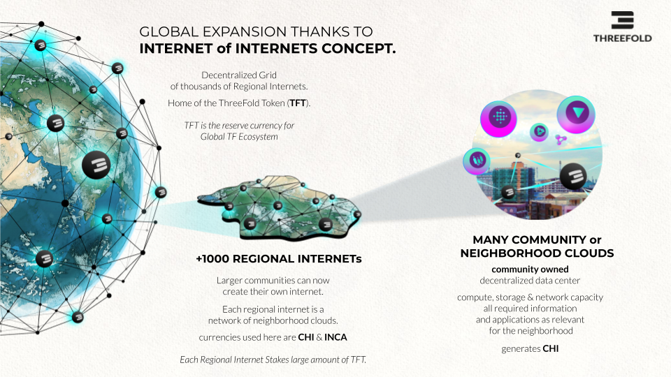

# The ThreeFold Decentralized Datacenter approach can scale to Billions of users

Each Regional Internet is created by a Genesis Farmer (a genesis farmer can be a local or federal government or tribe, but also a property development company,  university or even an Enterprise) who will look for investors who will receive INCA tokens in return for their investment. The INCA Certificates are a regulated investment instrument also registered on the blockchain and are structured as Sukuk certificates.

Each Genesis Farmer and its investors will deploy 50 Validators for the regional Internet and will fund a liquidity pool, this is a pool for making exchange between TFT and CHI easy and fluid.

# THE INCA CERTIFICATES

Investors in decentralized datacenter infrastructure can receive INCA certificates as proof of ownership and reward. These Certificates are valuable and can be made tradeable. We can also provide alternative investment mechanisms.

A Sukuk ("Sharia-compliant" bond) is an Islamic financial certificate that represents a portion of ownership in a portfolio of eligible existing or future assets. The INCA is technically created as a digital token (also called NFT) which represents value and is unique.

The INCA Certificates are transferable through blockchain technology.

Each INCA Certificate represents a certain amount of Internet Capacity value and is backed by guarantees.

Each INCA is linked to the following Certificate Properties

* The generator of the CHIs = the farmer who will convert INCA to CHI
* The conditions of this conversion (nr of CHI per INCA), from which date.
* The guarantees of this INCA e.g. the farmer uses their shares and assets as backing for the value of the INCA, so in case the INCA cannot be converted to the right amount of CHI at the right value the INCA owner has the option to convert into shares or demand FIAT currency.

All of this happens in an automated way by blockchain technology but can also be legally backed by contractual documents between the INCA Investor and the Farmer.

# EXAMPLE INCA PROJECT: 90M USD EDGE DATACENTER DEPLOYMENT TANZANIA 

This project will deploy 30 edge datacenters. Each edge datacenter generates CHI Tokens (CHI represent energy) which represent compute, storage and network capacity (think about it like kilowatt/h in electricity power generation facilities).

The earlier in the life cycle of ThreeFold a farmer generates capacity the more ThreeFold Tokens will be created (farmed/mined). The investor of those datacenters has INCA Certificates to prove ownership and receives the CHI as they are being farmed over time.

An investment of 90m USD has the potential to return 450m USD or more, this is possible thanks to the unique structure of the ThreeFold grid and how we generate INternet CApacity.

# INCA INVESTMENT BEST OF BOTH WORLDS

As an INCA investor I have the best of both worlds, I get a modern investment instrument which is protected by blockchain, real assets (edge datacenters) and legal documents as well as a known understood financial instrument called Sukuk.

This Investment Instrument INCA represents the digital gold of the future = Internet Capacity and is backed by the technology of an exciting technology company called ThreeFold who has already a lot of capacity deployed in many countries.

# The ThreeFold Grid Is Usable

Not only this returns profit for the investor but as important is that the Internet Capacity generated is usable for many different use cases and provides prosperity for the country which gets their own Regional Internet.  

A regional Internet created by the genesis farmers and financially supported by the INCA investors is able to function on its own.  The capacity created inside such a regional setup presents sovereign capacity carrying regional workloads without dependency on anything outside resulting in  true independence and resilience for that region.

# CHI SCARCITY AND LIFECYCLE

CHI is the energy token of the ThreeFold Internet. CHI is scarce and valuable.

CHI Farmers who start at creation mode can farm upto 10x more CHI compared to someone who enters the ecosystem at the end of the expansion phase. 

This is because the CHI farming reward is locked in at the point when the 3Node gets registered and this is in line with the CHI price at that stage. Each Regional internet starts with a CHI price of USD 0.1, the first deployments will be locked for a CHI farming reward at USD 0.1. If in the expansion phase the CHI goes to e.g. 0.5 USD it means that farmers at that stage will get 5x less reward for the same investment.

### Creation Phase

* Initial farmers deploy enough capacity to make the TF Grid (Internet Capacity Network) large enough to support expansion by everyone.
* Initial farmers deploy the first 50 validators and have to stake Threefold Tokens for it and will also put initial liquidity in the Liquidity pool.
* All initial deployed capacity is certified and does not require staking. In this stage the CHI price will be rather low and fluctuate until the network is ready for expansion.
* The CHI generated are put into a liquidity pool of the regional internet, whoever needs CHI for Internet Capacity or for Staking in expansion mode can buy the CHI from the liquidity pool, this generates income for the early farmers and potential possibility of early liquidity (in FIAT currency e.g. USD).

### Expansion 

* New farmers will have to stake CHI to get rewards, the amount to stake is in line with the reward as well as certification level. Any home, government entity, university or commercial provider can deploy additional capacity to the grid by means of deploying 3Nodes.
* This requires a lot of CHI to be locked into the network, people will have to buy these CHI which means liquidity is being created.
* The network now grows autonomous to a much larger scale as compared to the creation mode.

### Web 4

* The picture is probably misleading, Web4 and Expansion goes in parallel.
* Web4 expansion means use cases are being deployed on the grid which require buying CHI, these CHI can be bought from the liquidity pool providing early liquidity for who wants to (in FIAT currency e.g. USD).
* This will create a lot of extra scarcity & utilization of CHI which means price goes up.

### Velocity Mode

* The grid is now fully established and lots of people are using it.
* Velocity (means liquidity) now goes up dramatically and the CHI now becomes liquid.
* Everyone can now choose when to convert CHI to USD in line with liquidity.
* We are now 100% operational, a new internet has been created which is fully independent, green, performant, local and secure.

# 

# CHI = INTERNET ENERGY TOKEN DETAILS

* CHI = Internet Energy Token = is like kwatth for electricity
* 1 CHI presents compute storage, network capacity in the ThreeFold Network
* The first CHI token created was called TFT and represents Internet Capacity on the original ThreeFold grid.

## Farming = the creation of the tokens

Each [3Node](https://library.threefold.me/info/threefold#/tfgrid/farming/threefold__3node) (a part of an edge datacenter) has certain amount of compute, storage and network resources:

* Compute Capacity (CPU)
* Memory Capacity (RAM)
* Storage Capacity (SSD/HDD)
* Network Capacity (Bandwidth, IP Addresses)
For making this Internet Capacity available, Farmers are rewarded with CHI.

The amount of resources available in a [3Node](https://library.threefold.me/info/threefold#/tfgrid/farming/threefold__3node) are translated into compute units (CU), storage units (SU), Network units (NU) and IP addresses (IPAddr) to calculate farming rewards. See also [Cloud Units Calculation For Farming](https://library.threefold.me/info/threefold#/tfgrid/farming/threefold__resource_units_calc_cloudunits).

## Utilization = the use of the tokens = the utility

1. A user reserves Internet capacity on a given set of [3Nodes](https://library.threefold.me/info/threefold#/tfgrid/farming/threefold__3node).
2. [Zero-OS](https://library.threefold.me/info/threefold#/tfgrid/farming/threefold__zos) records the reserved and used CU, SU, NU and IPAddresses in correlation with [TFChain](https://library.threefold.me/info/threefold#/tfgrid/farming/threefold__tfchain) records.
3. The [TFChain](https://library.threefold.me/info/threefold#/tfgrid/farming/threefold__tfchain) [DAO](https://library.threefold.me/info/threefold#/tfgrid/farming/threefold__dao) will charge the costs to the user in line with the [discount mechanism](https://library.threefold.me/info/threefold#/tfgrid/farming/threefold__staking_discount_levels).
4. CHI from the user account are burned/distributed in line to the table below.

The burning makes sure that eventually more tokens will be burned compared to created.

