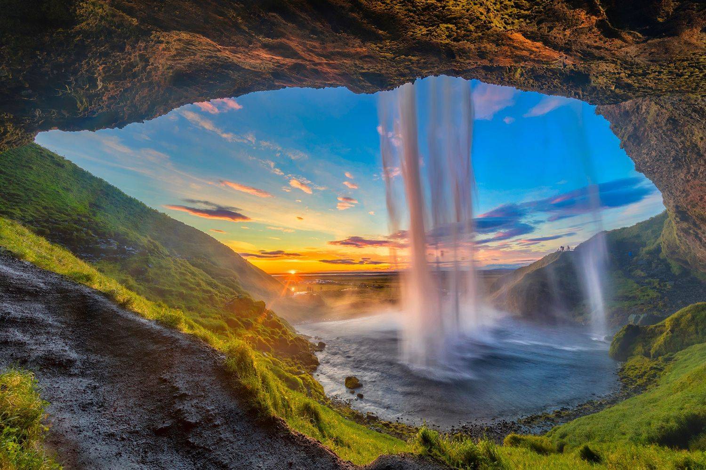

## **Goal 1: Realize the Internet of Internets Concept**

OurWorld Internet of Internets, is not one Internet as owned by the very few. It's thousands of interconnected Internets, where each Internet is founded and grown by a local community. YOU become The Internet.

OurWorld Internet of Internets is our chance to create a beautiful digital world in which we are free and powerful, a world where we can co-create a better future for everyone. We need to say NO to being a product of the large centralized corporations. We need to free ourselves, even from our own brainwashing.

We need a system where we:

* Can be free and independent yet fully interconnected over all OurWorld Internet of Internets

* Learn and play, grow in awareness and learn from each other

* Don’t have to be afraid of an uncertain future where the privileged few define the next steps

* Don’t become addicted to the biggest potential drug called money (money is not bad, money can be beautiful, money should be an energy source for change)

* Protect the beautiful planet we live on

