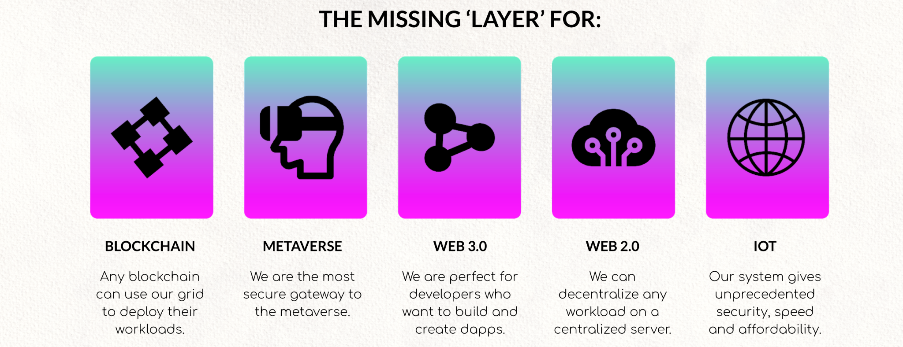

## **Goal 4: Become the Bitcoin for Internet Capacity = in a good way (-:**

TFT = a reliable digital currency for everyone in the world and provides equal chances.

<table>

|BTC for Money|ThreeFold for Internet Capacity|
|-------------|-------------------------------|
|$ are created by central banks, BTC by the people|Cloud by Amazon, Google, …, TFT by the people|
|Mining of BTC based on energy|Farming of TFT based on storage, compute, network|
|Endless Potential|Endless Potential, + trillion USD market|
|Store of value = digital currency|Store of Value = utility token = internet capacity|
|Price is currently > 40k USD|Price is currently = 0.09 USD|

