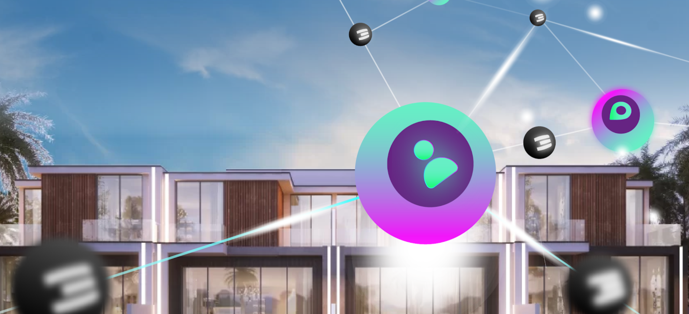
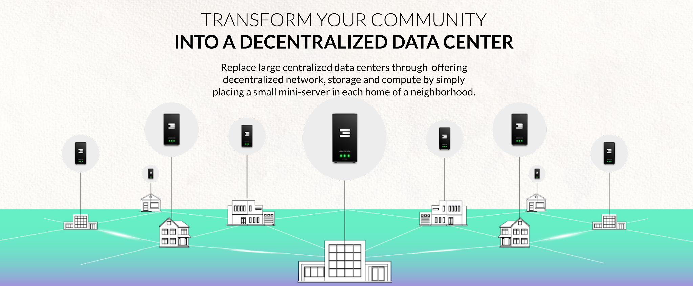

## **Goal 5: Make ThreeFold the most useful Internet Infrastructure in the world.**

Every day farmers are adding capacity to the ThreeFold Grid, we are growing quite well organically. There is a booster to let this happen faster, that's by means of our neighborhood cloud initiative also called INCA.

A neighborhood cloud is like a community driven decentralized data center. The initiative provides residents, businesses, developers and the government in your city with a secure and highly available sovereign cloud infrastructure to store and process their data locally.  ThreeFold works with Real Estate developers to deploy a large amount of Internet capacity in their projects, which is a win-win situation for the developer, the home owner and ThreeFold.

A first project in Dubai for 170 Villa’s has been realized and there is now a funnel of at least 10 more. Each project brings Internet capacity to the local community which is the easiest way to expand the ThreeFold Grid.

Next to our Neighborhood Cloud expansion model, we support our global Do-It-Yourself (DIY) and commercial farmers. 

A 2nd large neighborhood cloud is very close to being signed, this time with even more homes.
