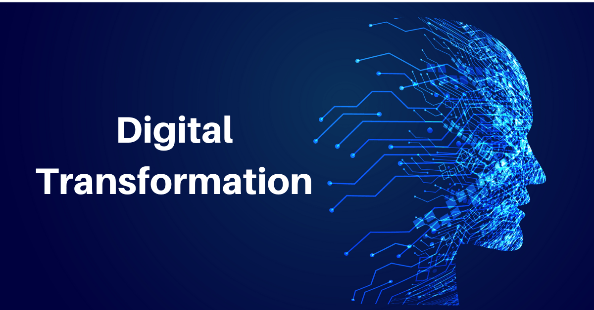

# Digital Transformation

  

Digital transformation is the implementation of digital technology leading to substantial improvements in the way a government or company’s operations and the value it offers to its clients/citizens.

Generally, it’s about evolving how an organization communicates with its customers as well as how they deliver a consistent experience to their customers whenever and wherever they need it.

We believe the state of technology is such that countries can leapfrog into a digital area where many of the current problems will simply no longer exist.

The root cause problems are

- pain killer approach (never a real solution, keep on patching the issue, this leads to inefficient money spending)
- onion problem (exponential growth of complexity)
- wrong IT paradigm (data models and client server)

Imagine a system which

- scales unlimited and is good for planet (green)
- has all relevant data available for all usecases, no reason to do duplication but yet still there is full data privacy where required.
- no need for complicated integration projects
- is affordable
- is sovereign, all data and logic is in country
- is super easy to expand

All of this is possible today with WEB4 and our digital backbone concept.

