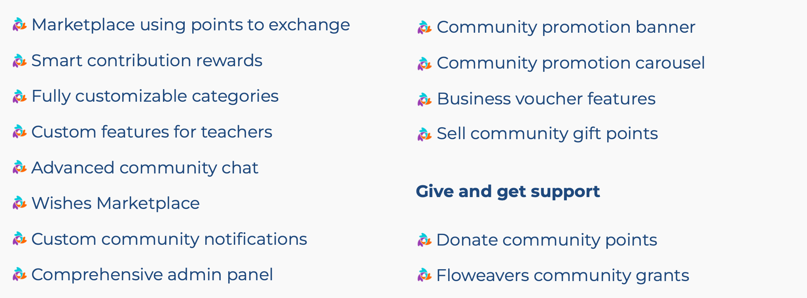
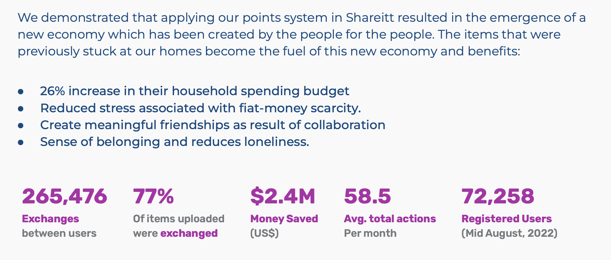
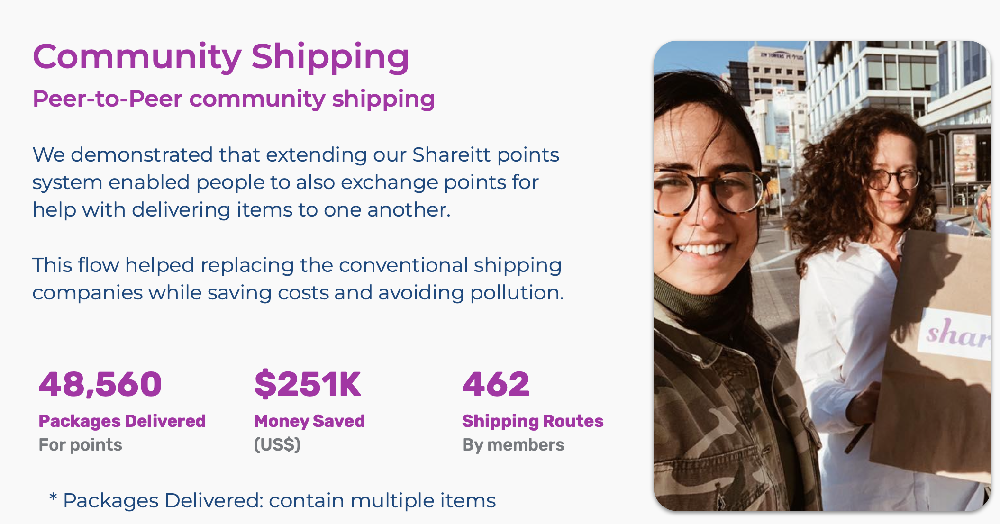

# Sharing Economy in Floweavers

## Usecase 1: shop without money

We all have great things that we don’t use anymore or that are stuck in our home. We won’t actually sell them and therefore no one benefits from it.
When markets fail due to limited supply of money or due to inefficient distribution, the traditional economical engine doesn’t function.
 
Features:

  
                             

  

> More info see this [document](floweavers_2.md)

## Usecase 2: Schools where Pupils help each other

Lacking the tools to enable effective and sustainable
collaboration and sharing between children, teachers and the school.

Traditional marketplaces use money to measure the exchange of values and resources. However, money cannot be used as recognition for the children’s contributions in the school.

We demonstrated that applying our gratitude points as recognition for their contributions and positive exchanges enabled a remarkable impact and flow of values.
Children, teachers and parents support each other, their school and staff resulting in:

- Shift from passive listeners to mutual learning through peer-to-peer teaching
- Kids extend their real life capabilities by practicing new skills
- Kids are significantly more engaged and happy
- Increased capacity of the school to effectively handle its objectives
   
 
## Usecase 3:  Social Delivery

**Enterprises to NGOs**

Large businesses are storing unimaginable excess inventory of goods.

Goods that were returned by customers, didn’t sell during the season or simply finished their use even though they are still in great condition.

Those resources are stuck, expensive to store, or dumped and no one benefits from it.

Flow of enterprises’ excess capacity becomes an income for NGOs:

1. Receive the valuable goods (in-kind donations)
1. Upload the goods to the Social Delivery (“SD”) marketplace
1. Distribute points to the approved NGOs as a monthly budget
1. NGOs shop in the SD marketplace for things they really need at the time needed NGOs 1. exchange their points for chosen merchandises and equipment
1. NGOs distribute these items to the communities they support
1. NGOs saves significant amount of money
1. Saved money enable the NGOs to better deliver on their core mission

*Tax credits for “in-kind donations” motivate enterprises to further participate and benefit for doing good out of zero value inventory that cost them money to store or eliminate.*

We demonstrated that applying Floweavers resulted in a win-win-situation both for the enterprises and the NGOs. The capacities and inventories that were stuck at the enterprises were donated and uploaded to the market place and became very useful for the NGOs.

- Participating NGOs received a monthly budget of $2,156 - $10,385 in points
- With this budget of points the NGOs could order online items that they needed
- NGOs were enabled to also offer help (and not just get donations)
- Keep their fiat money to better fulfill their core mission
- Businesses linked their in-kind donations towards their corporate responsibility.

  

## Usecase 4: Community Shipping

We developed a unique P2P delivery system using reward points.

Use case of a Peer2Peer community shipping:

Betty needed to pick up an item from a member, on the way back home she delivered an item to another member who lives near her, and gained additional points for it. The way it works:

1. Betty is scheduled to meet Lee to pick up an item
2. Lee asked Betty if she can also take another item for someone that lives next to her
3. Betty agreed and picked up two items: one for herself, one for another member -Rachel
4. Rachel contacted Betty to schedule a pickup time to get the item
5. Rachel rewarded Betty with points for delivering the item closer to her home.

  

