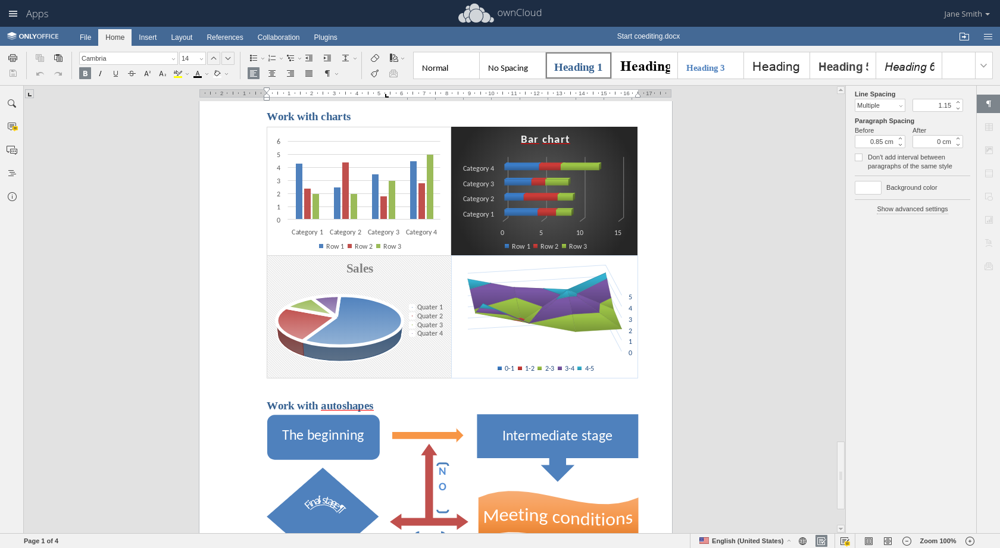
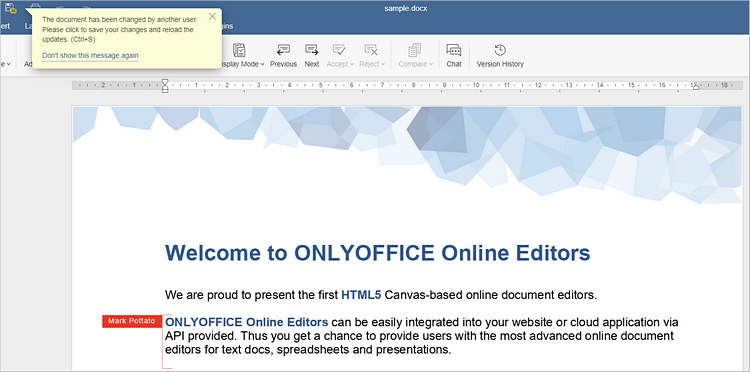
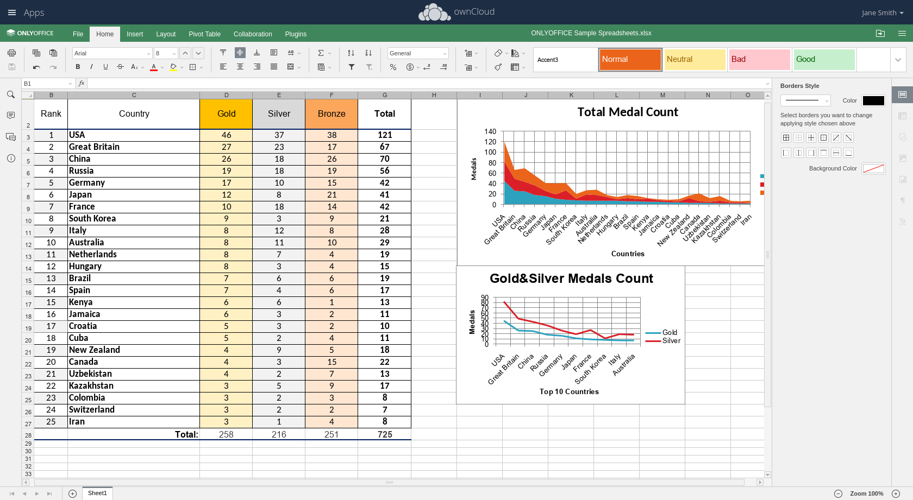
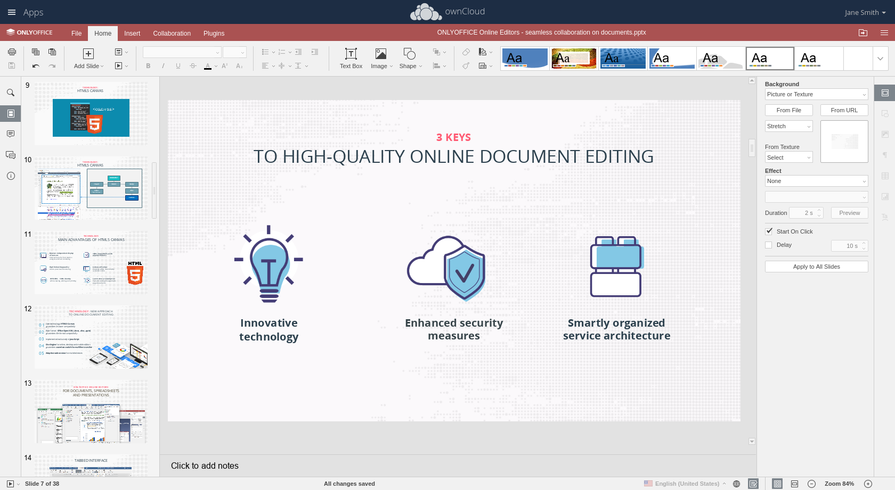

# Office Docs

  

<!--    -->

- By supporting all current MS Office formats, following file types can be collaboratively processed in ownCloud: docx, xlsx, pptx, txt files
Files can be saved in multiple formats: docx,odt, rtf, txt, pdf, html, pptx, odp, xlsx, csv, ods
- Users can add links, tables and graphics, insert diagrams, AutoShapes, mathematical formulas, font decoration, edit headers and footers, create style sheets, change the design of the whole document - with two mouse clicks and much more.
Users can switch into “Semi-Formal” mode to instantly see their co-author’s changes or go to “Formal” mode to work on the document without being distracted by others.
- Documents can be shared with different types of permissions: Users can choose between Download only, review, form fill, comment and edit to fully be in control who can view and change documents
- There are several communication features to further improve productivity: review, comment and live chat. Users can let their teammates review the document to correct misprints and suggest ideas without changing the text itself. Use the “Comment” option to leave funny text comments or discuss them using a built-in live chat.

  

  

