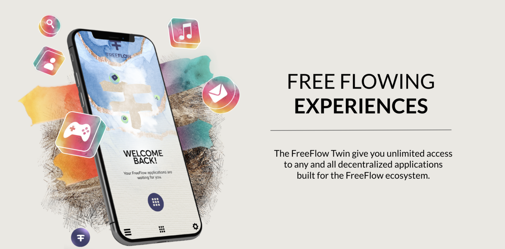

# Web vs real physical life.

  

Lets make a comparison of how our digital systems work in relation to how we do things in day to day life, in this case we are comparing with an educational event.

We hope you will see how current web experiences are and not logical, they are designed to lock us in ,and treat us like their product rather than being only at our service.

### The Web 2 way = the current internet.

- I go to an educational event, it is very affordable, maybe even free
- They ask me to change clothes and use theirs, so we all look alike
- I am not allowed to bring or use my own tools. They give me theirs, a pen, headset, glasses, and a notebook, which I am asked to return at the end
- The event creators keep my freedom limited and overwhelm me with audio/video experience, if I am allowed to chose, it is all based on their scripts
- They drive me around from activity to activity in the experience, its all very well done and impressive
- They track everything I do, to make sure they can adjust the experience to have me even more impressed next time, because they want me to come back
- If I take notes it is in their notebook, but I can't take it with me, if they destroy it its gone
- I am happy, because it's all incredible and very well done
- I take the commercial content for granted because yeh, you know I got this for a low cost, they need to make money too
- If I want to get back to the content of the event, I need to pay again and go through the event again
- If I would go to another (similar) event from another provider, I would have to restart from scratch, I would have to get other tools, another notebook, I cannot reuse what I have produced on the first event.

However, the good thing is, I don't have to think that much and it is very addictive, they learn very well what we like and keep on improving constantly, so we want to come back.

### The Web 3 way

- All as above, but the event is not owned by a company but by all of us
- We have a vote in how the event should be created
- It is at least better because if, working properly, it iss a consensus owned experience
- Now at least we have the feeling we co-own how the event is being created
- We will realize its all very hard to run a real democracy

### The FreeFlow Way

- I go to the education event
- They check if the tools I have are up-to-date for the experience they have created. If not they tell me where I can get new tools (upgrade them), but they remain mine. These tools are my core digital capabilities or skills,
- I can now go into the event and experience 'the experience' as prepared for me, I walk freely around, I take notes on my notebook, so I can use it later,
- I have a lot of freedom where to go, and what to do first,
- I can use many more of my capabilities, I don't have to learn new ways to do something, because the tools (capabilities) are mine. I can dance, sing, run, jump, ...
- I will be able to do things the creators of the event did not foresee, there is so much joy and freedom, I am creative and I am alive,
- Its easier to make friends, because I can bring my friends in a much easier way, because they already have the required capabilities,
- I can give authenticity to the experience, my feedback matters from out of my own power,
- It might be I have to think and act more myself, I am using my tools (capabilities) in the incredible experience as created by the education event organizers,
- I will be super happy because I feel empowered, I am less addicted maybe because I am less controlled, but I know whatever I learned is for me to keep, I feel productive because I am allowed to use my capabilities, and my data was enriched by me..

> PS: This event can be single owned or co-owned (like in web3).

Doesn't this sound like a better idea, don't we wanna have a tool which works that way?

