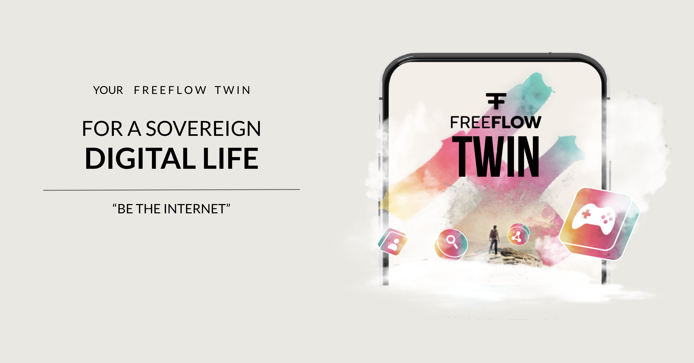

  

# My Personal Digital Twin

## I am Powerful, I am alive,   &nbsp;&nbsp;&nbsp;&nbsp;&nbsp;&nbsp;&nbsp;&nbsp;&nbsp;&nbsp;&nbsp;&nbsp;&nbsp;&nbsp;&nbsp;&nbsp;&nbsp;&nbsp;&nbsp;&nbsp;&nbsp;&nbsp;&nbsp;&nbsp;&nbsp; meet my Digital Twin

Imagine a world where we are powerful, skilled and sovereign, where we can learn and teach every day.

A crazy world

- finding any information is free and authentic
- education information is everywhere and the result of students becoming teachers
- creating and owning information is unlimited
- exchanging value is free and unlimited as well, no borders
- telling about your product or services is free, no need to pay for promotion
- finding products or services is free, no need to pay for an aggregation site Airbnb
- communication is free follows shortest path and not listened too
- co-ownership is easy to organize
- collaboration is easy and based on your digital skills

> This is not just a dream, its a dream which is becoming reality.

