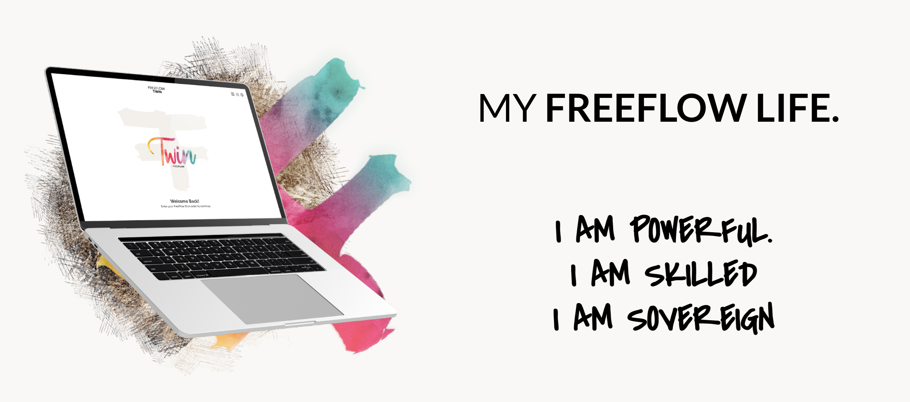
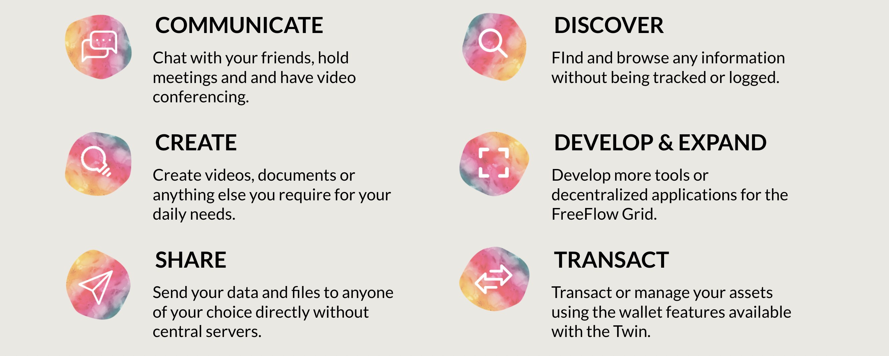
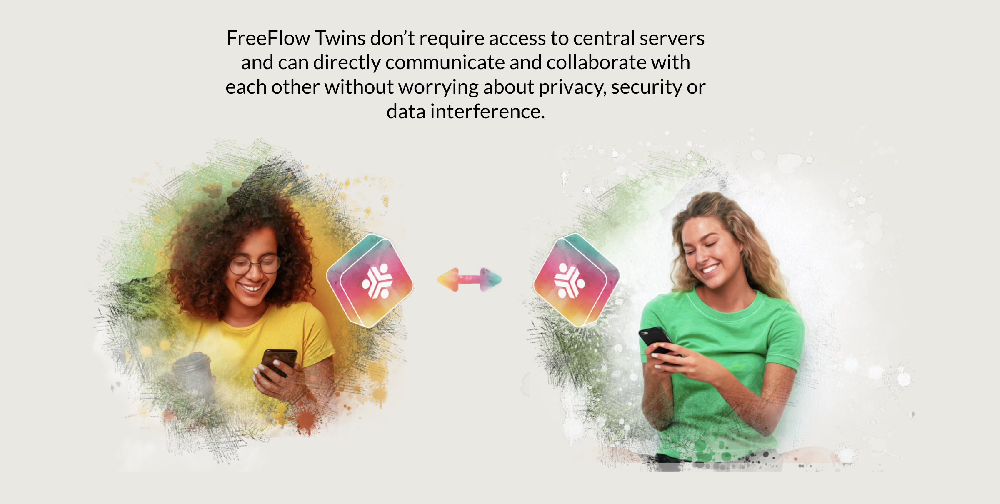

# I am Powerful, I am alive,   &nbsp;&nbsp;&nbsp;&nbsp;&nbsp;&nbsp;&nbsp;&nbsp;&nbsp;&nbsp;&nbsp;&nbsp;&nbsp;&nbsp;&nbsp;&nbsp;&nbsp;&nbsp;&nbsp;&nbsp;&nbsp;&nbsp;&nbsp;&nbsp;&nbsp; meet my Digital Twin

  

Every person owns a Digital Twin, which is your personal Internet Gateway Application. This Digital Twin (allso called freeflow) is running on a location of your choice. Each twin is owned by only 1 owner. The Twin has lots of capabilities and serves its owner 24h a day, 7/7. Experiences are being built which use the capabilities of the Twin.

Experiences are being built which use the capabilities of the twin.

  

A twin owns your data and your identity. All data is stored in such a way it can never be corrupted or lost. You own your data, identity and your digital skills for all your life.

And when you die you can handover your digital heritage to your beloved ones.

Each Twin has following capabilities:

  

Twins are unique they talk directlty to each other, there are no centralized datacenters or server farms needed.

  

